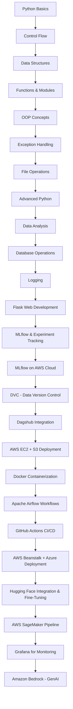

# 🚀 MLOps Learning Journey

[](https://python.org)
[](https://mlflow.org)
[](https://jupyter.org)
[](https://flask.palletsprojects.com)
[](https://pandas.pydata.org)
[](https://numpy.org)
[](https://scikit-learn.org)
[](https://dvc.org)

[](https://www.docker.com)
[](https://airflow.apache.org/)
[](https://dagshub.com/)
[](https://www.mysql.com/)

[](https://aws.amazon.com)
[](https://aws.amazon.com/ec2/)
[](https://aws.amazon.com/s3/)
[](https://aws.amazon.com/rds/)
[](https://aws.amazon.com/ecr/)
[](https://aws.amazon.com/elasticbeanstalk/)
[](https://aws.amazon.com/codepipeline/)
[](https://aws.amazon.com/bedrock/)
[](https://aws.amazon.com/sagemaker/)

[](https://azure.microsoft.com)

[](https://github.com/features/actions)
[](https://github.com/features/actions)


> **A comprehensive MLOps learning repository covering Python fundamentals to advanced machine learning operations, experiment tracking, and deployment strategies.**

## 📋 Table of Contents

- [🎯 Overview](#-overview)
- [🛠️ Prerequisites](#️-prerequisites)
- [📚 Learning Path](#-learning-path)
- [🚀 Quick Start](#-quick-start)
- [📖 Module Breakdown](#-module-breakdown)
- [🔧 Tools & Technologies](#-tools--technologies)
- [💡 Projects](#-projects)
- [🧱 Additional Tech Stack](#-additional-tech-stack)
- [📘 Resources](#-resources)


## 🎯 Overview

This repository serves as a complete learning resource for **Machine Learning Operations (MLOps)**, starting from Python fundamentals and progressing to advanced MLOps practices. Whether you're a beginner or looking to enhance your MLOps skills, this structured curriculum will guide you through:

- **Python Programming Fundamentals**
- **Data Analysis & Manipulation**
- **Machine Learning Model Development**
- **Experiment Tracking with MLflow**
- **Cloud-based MLflow on AWS Infrastructure**
- **AWS SageMaker for Enterprise ML**
- **Data Version Control with DVC**
- **Model Deployment & Monitoring**
- **Web Application Development with Flask**

## 🛠️ Prerequisites

- Basic understanding of programming concepts
- Python 3.8 or higher installed
- Git for version control
- Jupyter Notebook/Lab environment
- Basic knowledge of machine learning concepts (helpful but not required)

## 📚 Learning Path
## 📚 Updated Learning Path



## 🚀 Updated Quick Start

1. **Clone the repository:**
   ```bash
   git clone https://github.com/jagadeshchilla/MLOPS.git
   cd MLOPS
   ```

2. **Set up virtual environment:**
   ```bash
   python -m venv venv
   source venv/bin/activate  
   venv\Scripts\activate
   ```

3. **Install dependencies:**
   ```bash
   pip install -r mlflow/requirements.txt
   ```

4. **Start Jupyter Lab:**
   ```bash
   jupyter lab
   ```

5. **Launch MLflow UI:**
   ```bash
   mlflow ui
   ```

## 📖 Module Breakdown

### 🐍 **Python Fundamentals (Modules 1-9)**

| Module | Topic | Description | Key Concepts |
|--------|-------|-------------|--------------|
| **1** | Python Basics | Variables, data types, operators | Foundation concepts |
| **2** | Control Flow | Conditional statements, loops | Decision making & iteration |
| **3** | Data Structures | Lists, tuples, sets, dictionaries | Data organization |
| **4** | Functions | Function definition, lambda, map/filter | Code reusability |
| **5** | Modules | Import systems, packages | Code organization |
| **6** | File Handling | File I/O operations | Data persistence |
| **7** | Exception Handling | Error handling, custom exceptions | Robust programming |
| **8** | OOP | Classes, inheritance, polymorphism | Object-oriented design |
| **9** | Advanced Python | Iterators, generators, decorators | Advanced techniques |

### 📊 **Data Science & Analysis (Module 10)**

- **NumPy**: Numerical computing and array operations
- **Pandas**: Data manipulation and analysis
- **Matplotlib**: Data visualization and plotting
- **Seaborn**: Statistical data visualization
- **Data Processing**: Reading from CSV, Excel, and various formats

### 🗄️ **Database Operations (Module 11)**

- **SQLite3**: Database creation and management
- **CRUD Operations**: Create, Read, Update, Delete
- **Data Integration**: Connecting Python with databases

### 📝 **Logging & Monitoring (Module 12)**

- **Python Logging**: Structured logging practices
- **Multiple Loggers**: Advanced logging configurations
- **Log Management**: Best practices for production systems

### 🌐 **Web Development (Module 13)**

- **Flask Framework**: Web application development
- **API Development**: RESTful API creation
- **Template Rendering**: Dynamic web pages
- **Static Files**: CSS, JavaScript integration

### 🐳 **Docker Containerization**

- **Container Orchestration**: Docker-based application deployment
- **Alpine Linux**: Lightweight, secure container base images
- **Flask Containerization**: Production-ready web application containers
- **DevOps Integration**: CI/CD pipeline integration with Docker
- **Microservices Architecture**: Scalable, containerized service deployment

### 🌊 **Apache Airflow & Workflow Orchestration**

- **DAG Development**: Directed Acyclic Graph workflow creation
- **Task Scheduling**: Automated task execution and dependency management
- **MLOps Pipeline Orchestration**: End-to-end ML workflow automation
- **Astro CLI Integration**: Modern development and deployment tooling
- **Monitoring & Observability**: Comprehensive workflow monitoring and alerting

### 🚀 **GitHub Actions CI/CD**

- **Continuous Integration**: Automated code validation and testing
- **Continuous Deployment**: Streamlined deployment workflows  
- **Automated Testing**: Comprehensive test suite with pytest
- **Code Quality Gates**: Flake8 linting and coverage reporting
- **Multi-Python Support**: Matrix testing across Python 3.8, 3.9, 3.10
- **Security Scanning**: Dependency auditing and vulnerability detection

### 🔬 **MLflow & Experiment Tracking**

- **Experiment Tracking**: Model versioning and metrics logging  
- **Model Registry**: Centralized model management  
- **Deployment**: Model serving and monitoring  
- **Hyperparameter Tuning**: Automated optimization workflows  


### 📂 **Data Version Control (DVC)**

- **DVC Init & Setup**: Track large data files and models  
- **Data Pipelines**: Automate preprocessing and training steps  
- **Versioning**: Manage dataset/model history like Git  
- **Remote Storage**: Push/pull from S3, GDrive, or DagsHub  

### 🌐 **DagsHub Integration**

- **End-to-End MLOps Platform**: Combines Git, DVC, MLflow  
- **Experiment Logging**: Track experiments on DagsHub via MLflow  
- **Collaboration**: Share datasets, models, and runs  
- **Visualization**: View lineage, metrics, and model artifacts  


### ☁️ **Cloud Deployments (AWS & Azure)**

- **AWS EC2 + S3**: Host MLflow tracking server, manage artifacts  
- **Elastic Beanstalk**: Deploy production-ready ML web apps  
- **Azure App Services**: Cross-cloud deployment of Flask/API apps  
- **CodePipeline & IAM**: CI/CD automation and role-based security  


### 📊 **Grafana Monitoring Integration**

- **Real-time Dashboarding**: Monitor training logs, system metrics  
- **Custom Alerts**: Track data drift, performance, and failures  
- **CloudWatch + Grafana**: Unified AWS observability  
- **ML Model Monitoring**: Visualize accuracy, latency, loss over time  

## 🔧 Tools & Technologies
Technologies i have learned so far
### **Core Technologies**
-  **Python 3.8+**
-  **Jupyter Notebooks**
-  **Version Control**

### **Data Science Stack**
-  **NumPy**
-  **Pandas**
-  **Matplotlib**
-  **Seaborn**

### **Machine Learning & MLOps**
-  **Scikit-learn**
-  **MLflow**
-  **DVC**
-  **DagsHub**
-  **TensorFlow**
-  **Keras**
-  **Hugging Face**

### **Web Development**
-  **Flask**
-  **HTML5**
-  **CSS3**

### **Containerization & DevOps**
-  **Docker**
-  **Alpine Linux**

### **Workflow Orchestration**
-  **Apache Airflow**
-  **Astro CLI**

### **CI/CD & Automation**
-  **GitHub Actions**
-  **AWS CodePipeline**
-  **Pytest**
-  **Automated Quality Gates**

### **Cloud Infrastructure**
-  **Amazon Web Services**
-  **Elastic Compute Cloud**
-  **Simple Storage Service**
-  **Relational Database Service**
-  **Elastic Container Registry**
-  **Elastic Beanstalk**
-  **Machine Learning Platform**
-  **Identity & Access Management**
-  **Amazon Bedrock**
-  **Microsoft Azure**

### **Databases & Monitoring**
-  **MySQL**
-  **Grafana**


## 💡 Projects

I have done some projects along with learning this tech stack — it was a wonderful journey!  
Each project helped reinforce practical MLOps, data science, DevOps, and cloud deployment skills.  
Check out the table below to explore my work:

| Project Name | Description | Tech Stack | Link |
|--------------|-------------|------------|------|
| House Price Prediction with MLflow | ML model training and experiment tracking with MLflow |     | [Repo](https://github.com/jagadeshchilla/housePricePrediction-with-Ml-Flow) |
| ANN with MLflow | Neural network model tracked and visualized with MLflow |      | [Repo](https://github.com/jagadeshchilla/ANN-with-ML-flow) |
| DVC & MLflow Pipeline | ML pipeline with DVC and MLflow for versioning and tracking |      | [Repo](https://github.com/jagadeshchilla/Data-Pipeline-with-DVC-and-MLflow-for-Machine-Learning) |
| NASA APOD ETL Pipeline | ETL pipeline using Apache Airflow to pull data from NASA API |      | [Repo](https://github.com/jagadeshchilla/NASA-APOD-ETL-Pipeline-with-Apache-Airflow) |
| GitHub Actions Test | Simple CI/CD pipeline using GitHub Actions |    | [Repo](https://github.com/jagadeshchilla/test_github_actions) |
| Dockerized Flask App | Flask app containerized using Docker |     | [Repo](https://github.com/jagadeshchilla/dockerImage) |
| Wine Quality Prediction | ML model for predicting wine quality |       | [Repo](https://github.com/jagadeshchilla/wine-quality-prediction) |
| Phishing Detection API | ML API to detect phishing websites |      | [Repo](https://github.com/jagadeshchilla/phishing-detecting) |
| Student Performance (EC2) | ML deployment on AWS EC2 using Docker + CI/CD |     | [Repo](https://github.com/jagadeshchilla/student_performance_EC2) |
| Student Performance (Beanstalk) | Flask ML app deployed via AWS Elastic Beanstalk |     | [Repo](https://github.com/jagadeshchilla/Student-Perfromance-Predictor) |
| Student Performance (Azure) | Flask app deployed to Azure App Service |     | [Repo](https://github.com/jagadeshchilla/student_performance_AZURE) |
| Text Summarizer API | Text summarization using Transformers and Hugging Face |     | [Repo](https://github.com/jagadeshchilla/TextSummarizer) |
| Mobile Classification (SageMaker) | Mobile price classification using AWS SageMaker |     | [Repo](https://github.com/jagadeshchilla/Mobile_classification_AWS_SAGEMAKER) |

## 🧱 Additional Tech Stack

I have learned this tech stack as part of my MLOps journey — spanning model development, experiment tracking, containerization, orchestration, automation, and deployment.

### ✅ Learned MLOps Tools & Libraries


---

### 🚀 Other MLOps Tools I'm Planning to Explore

Here are some powerful tools I aim to explore and implement in upcoming projects for a complete MLOps lifecycle:


These tools will help me advance into scalable and enterprise-ready MLOps workflows using Kubernetes, event-driven pipelines, and real-time monitoring.

## 📘 Resources

Here are some of the learning materials and official documentation that helped me build strong foundations in MLOps and Cloud-based ML systems:

### 🎓 Courses

- [Complete MLOps Bootcamp: Machine Learning Operations for Beginners (Udemy)](https://www.udemy.com/share/10bYlh3@OqXRFcDiO4SKZjaHz09W3wZkfmwzgAKZ-_cvRtC_O97lmTMOYMXFqm3EerQXQGNy5Q==/)

### 📚 Official Documentation

- [Python Docs](https://docs.python.org/3/)
- [MLflow Documentation](https://mlflow.org/docs/latest/index.html)
- [DVC Docs](https://dvc.org/doc)
- [Dagshub Docs](https://dagshub.com/docs/)
- [Docker Docs](https://docs.docker.com/)
- [Apache Airflow Docs](https://airflow.apache.org/docs/)
- [GitHub Actions Docs](https://docs.github.com/en/actions)
- [AWS EC2 Docs](https://docs.aws.amazon.com/ec2/)
- [AWS S3 Docs](https://docs.aws.amazon.com/s3/)
- [AWS SageMaker Docs](https://docs.aws.amazon.com/sagemaker/)
- [AWS Bedrock Docs](https://docs.aws.amazon.com/bedrock/)
- [AWS RDS Docs](https://docs.aws.amazon.com/rds/)
- [AWS Elastic Beanstalk Docs](https://docs.aws.amazon.com/elasticbeanstalk/)
- [Azure Docs](https://learn.microsoft.com/en-us/azure/)
- [Grafana Docs](https://grafana.com/docs/)
- [FastAPI Docs](https://fastapi.tiangolo.com/)
- [Hugging Face Transformers Docs](https://huggingface.co/docs/transformers/index)
- [TensorFlow Docs](https://www.tensorflow.org/guide)
- [Keras Docs](https://keras.io/)
- [Jupyter Notebook Docs](https://jupyter-notebook.readthedocs.io/en/stable/)

---

<div align="center">

**Happy Learning! 🚀**

*"The journey of a thousand models begins with a single commit."*

[](https://github.com/jagadeshchilla)

</div> 