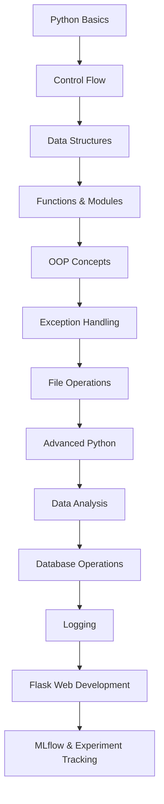

# 🚀 MLOps Learning Journey

[](https://python.org)
[](https://mlflow.org)
[](https://jupyter.org)
[](https://flask.palletsprojects.com)
[](https://pandas.pydata.org)
[](https://numpy.org)
[](https://scikit-learn.org)

[](https://opensource.org/licenses/MIT)
[](http://makeapullrequest.com)
[](https://github.com/jagadeshchilla/MLOPS/stargazers)

> **A comprehensive MLOps learning repository covering Python fundamentals to advanced machine learning operations, experiment tracking, and deployment strategies.**

## 📋 Table of Contents

- [🎯 Overview](#-overview)
- [🛠️ Prerequisites](#️-prerequisites)
- [📚 Learning Path](#-learning-path)
- [🚀 Quick Start](#-quick-start)
- [📖 Module Breakdown](#-module-breakdown)
- [🔧 Tools & Technologies](#-tools--technologies)
- [💻 Installation](#-installation)
- [🧪 Running Examples](#-running-examples)
- [📊 MLflow Integration](#-mlflow-integration)
- [🤝 Contributing](#-contributing)

## 🎯 Overview

This repository serves as a complete learning resource for **Machine Learning Operations (MLOps)**, starting from Python fundamentals and progressing to advanced MLOps practices. Whether you're a beginner or looking to enhance your MLOps skills, this structured curriculum will guide you through:

- **Python Programming Fundamentals**
- **Data Analysis & Manipulation**
- **Machine Learning Model Development**
- **Experiment Tracking with MLflow**
- **Model Deployment & Monitoring**
- **Web Application Development with Flask**

## 🛠️ Prerequisites

- Basic understanding of programming concepts
- Python 3.8 or higher installed
- Git for version control
- Jupyter Notebook/Lab environment
- Basic knowledge of machine learning concepts (helpful but not required)

## 📚 Learning Path



## 🚀 Quick Start

1. **Clone the repository:**
   ```bash
   git clone https://github.com/jagadeshchilla/MLOPS.git
   cd MLOPS
   ```

2. **Set up virtual environment:**
   ```bash
   python -m venv mlops-env
   source mlops-env/bin/activate  # On Windows: mlops-env\Scripts\activate
   ```

3. **Install dependencies:**
   ```bash
   pip install -r mlflow/requirements.txt
   ```

4. **Start Jupyter Lab:**
   ```bash
   jupyter lab
   ```

5. **Launch MLflow UI:**
   ```bash
   mlflow ui
   ```

## 📖 Module Breakdown

### 🐍 **Python Fundamentals (Modules 1-9)**

| Module | Topic | Description | Key Concepts |
|--------|-------|-------------|--------------|
| **1** | Python Basics | Variables, data types, operators | Foundation concepts |
| **2** | Control Flow | Conditional statements, loops | Decision making & iteration |
| **3** | Data Structures | Lists, tuples, sets, dictionaries | Data organization |
| **4** | Functions | Function definition, lambda, map/filter | Code reusability |
| **5** | Modules | Import systems, packages | Code organization |
| **6** | File Handling | File I/O operations | Data persistence |
| **7** | Exception Handling | Error handling, custom exceptions | Robust programming |
| **8** | OOP | Classes, inheritance, polymorphism | Object-oriented design |
| **9** | Advanced Python | Iterators, generators, decorators | Advanced techniques |

### 📊 **Data Science & Analysis (Module 10)**

- **NumPy**: Numerical computing and array operations
- **Pandas**: Data manipulation and analysis
- **Matplotlib**: Data visualization and plotting
- **Seaborn**: Statistical data visualization
- **Data Processing**: Reading from CSV, Excel, and various formats

### 🗄️ **Database Operations (Module 11)**

- **SQLite3**: Database creation and management
- **CRUD Operations**: Create, Read, Update, Delete
- **Data Integration**: Connecting Python with databases

### 📝 **Logging & Monitoring (Module 12)**

- **Python Logging**: Structured logging practices
- **Multiple Loggers**: Advanced logging configurations
- **Log Management**: Best practices for production systems

### 🌐 **Web Development (Module 13)**

- **Flask Framework**: Web application development
- **API Development**: RESTful API creation
- **Template Rendering**: Dynamic web pages
- **Static Files**: CSS, JavaScript integration

### 🔬 **MLflow & Experiment Tracking**

- **Experiment Tracking**: Model versioning and metrics logging
- **Model Registry**: Centralized model management
- **Deployment**: Model serving and monitoring
- **Hyperparameter Tuning**: Automated optimization workflows

## 🔧 Tools & Technologies

### **Core Technologies**
-  **Python 3.8+**
-  **Jupyter Notebooks**
-  **Version Control**

### **Data Science Stack**
-  **NumPy**
-  **Pandas**
-  **Matplotlib**
-  **Seaborn**

### **Machine Learning & MLOps**
-  **Scikit-learn**
-  **MLflow**
-  **TensorFlow**
-  **Keras**

### **Web Development**
-  **Flask**
-  **HTML5**
-  **CSS3**

## 💻 Installation

### **Option 1: Using pip**
```bash
pip install mlflow scikit-learn pandas numpy keras tensorflow hyperopt flask jupyter
```

### **Option 2: Using conda**
```bash
conda create -n mlops python=3.8
conda activate mlops
conda install -c conda-forge mlflow scikit-learn pandas numpy keras tensorflow
pip install hyperopt flask
```

### **Option 3: Using requirements.txt**
```bash
pip install -r mlflow/requirements.txt
```

## 🧪 Running Examples

### **Python Fundamentals**
```bash
# Navigate to any module directory
cd "1-Python Basics"
jupyter lab 1.0-basic.ipynb
```

### **Data Analysis**
```bash
cd "10-Data Analysis With Python"
jupyter lab 10.1-numpy.ipynb
```

### **MLflow Experiments**
```bash
cd mlflow
mlflow ui  # Start MLflow UI
jupyter lab get-started.ipynb
```

### **Flask Applications**
```bash
cd "13-Flask/flask"
python app.py
```

## 📊 MLflow Integration

This repository includes comprehensive MLflow examples:

### **🎯 Experiment Tracking**
- Model parameter logging
- Metrics tracking
- Artifact storage
- Model versioning

### **🏗️ Model Registry**
- Model registration
- Version management
- Stage transitions
- Model serving

### **📈 Projects Structure**
```
mlflow/
├── 1-MLproject/          # Basic MLflow project setup
├── 2-DLMLFLOW/          # Deep learning with MLflow
├── get-started.ipynb    # Quick start guide
└── requirements.txt     # Dependencies
```

## 🎓 Learning Outcomes

By completing this course, you will:

- ✅ Master Python programming fundamentals
- ✅ Understand data analysis and visualization
- ✅ Implement machine learning workflows
- ✅ Track experiments with MLflow
- ✅ Deploy models using Flask
- ✅ Follow MLOps best practices
- ✅ Build end-to-end ML pipelines

## 🤝 Contributing

We welcome contributions! Please see our contributing guidelines:

1. Fork the repository
2. Create a feature branch (`git checkout -b feature/AmazingFeature`)
3. Commit your changes (`git commit -m 'Add some AmazingFeature'`)
4. Push to the branch (`git push origin feature/AmazingFeature`)
5. Open a Pull Request


## 🙏 Acknowledgments

- MLflow community for excellent documentation
- Python community for comprehensive libraries
- Open source contributors who make learning accessible

## 📞 Support

If you have questions or need help:

- 📧 Create an issue in this repository
- 💬 Join our discussions
- 🌟 Star this repository if you find it helpful!

---

<div align="center">

**Happy Learning! 🚀**

*"The journey of a thousand models begins with a single commit."*

[](https://github.com/jagadeshchilla)

</div> 