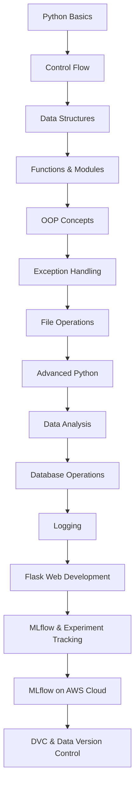
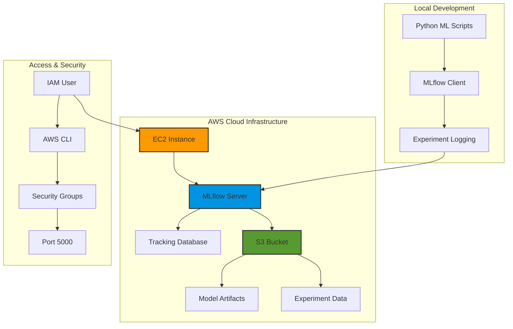
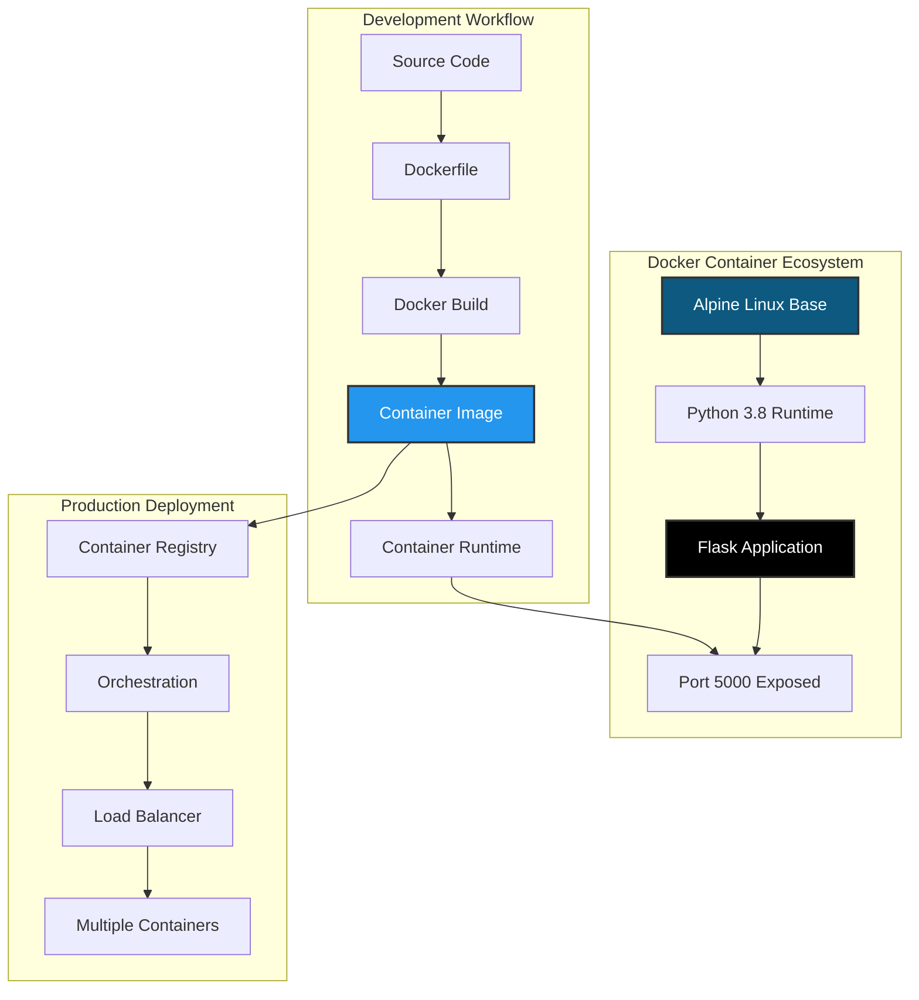
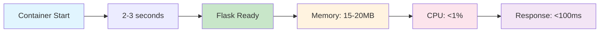

# 🚀 MLOps Learning Journey

[](https://python.org)
[](https://mlflow.org)
[](https://jupyter.org)
[](https://flask.palletsprojects.com)
[](https://pandas.pydata.org)
[](https://numpy.org)
[](https://scikit-learn.org)
[](https://dvc.org)
[](https://aws.amazon.com)
[](https://aws.amazon.com/ec2/)
[](https://aws.amazon.com/s3/)

[](https://opensource.org/licenses/MIT)
[](http://makeapullrequest.com)
[](https://github.com/jagadeshchilla/MLOPS/stargazers)

> **A comprehensive MLOps learning repository covering Python fundamentals to advanced machine learning operations, experiment tracking, and deployment strategies.**

## 📋 Table of Contents

- [🎯 Overview](#-overview)
- [🛠️ Prerequisites](#️-prerequisites)
- [📚 Learning Path](#-learning-path)
- [🚀 Quick Start](#-quick-start)
- [📖 Module Breakdown](#-module-breakdown)
- [🔧 Tools & Technologies](#-tools--technologies)
- [💻 Installation](#-installation)
- [🧪 Running Examples](#-running-examples)
- [📊 MLflow Integration](#-mlflow-integration)
- [☁️ MLflow on AWS](#️-mlflow-on-aws)
- [🗂️ DVC Demo](#️-dvc-demo)
- [🤝 Contributing](#-contributing)

## 🎯 Overview

This repository serves as a complete learning resource for **Machine Learning Operations (MLOps)**, starting from Python fundamentals and progressing to advanced MLOps practices. Whether you're a beginner or looking to enhance your MLOps skills, this structured curriculum will guide you through:

- **Python Programming Fundamentals**
- **Data Analysis & Manipulation**
- **Machine Learning Model Development**
- **Experiment Tracking with MLflow**
- **Cloud-based MLflow on AWS Infrastructure**
- **Data Version Control with DVC**
- **Model Deployment & Monitoring**
- **Web Application Development with Flask**

## 🛠️ Prerequisites

- Basic understanding of programming concepts
- Python 3.8 or higher installed
- Git for version control
- Jupyter Notebook/Lab environment
- Basic knowledge of machine learning concepts (helpful but not required)

## 📚 Learning Path



## 🚀 Quick Start

1. **Clone the repository:**
   ```bash
   git clone https://github.com/jagadeshchilla/MLOPS.git
   cd MLOPS
   ```

2. **Set up virtual environment:**
   ```bash
   python -m venv mlops-env
   source mlops-env/bin/activate  # On Windows: mlops-env\Scripts\activate
   ```

3. **Install dependencies:**
   ```bash
   pip install -r mlflow/requirements.txt
   ```

4. **Start Jupyter Lab:**
   ```bash
   jupyter lab
   ```

5. **Launch MLflow UI:**
   ```bash
   mlflow ui
   ```

## 📖 Module Breakdown

### 🐍 **Python Fundamentals (Modules 1-9)**

| Module | Topic | Description | Key Concepts |
|--------|-------|-------------|--------------|
| **1** | Python Basics | Variables, data types, operators | Foundation concepts |
| **2** | Control Flow | Conditional statements, loops | Decision making & iteration |
| **3** | Data Structures | Lists, tuples, sets, dictionaries | Data organization |
| **4** | Functions | Function definition, lambda, map/filter | Code reusability |
| **5** | Modules | Import systems, packages | Code organization |
| **6** | File Handling | File I/O operations | Data persistence |
| **7** | Exception Handling | Error handling, custom exceptions | Robust programming |
| **8** | OOP | Classes, inheritance, polymorphism | Object-oriented design |
| **9** | Advanced Python | Iterators, generators, decorators | Advanced techniques |

### 📊 **Data Science & Analysis (Module 10)**

- **NumPy**: Numerical computing and array operations
- **Pandas**: Data manipulation and analysis
- **Matplotlib**: Data visualization and plotting
- **Seaborn**: Statistical data visualization
- **Data Processing**: Reading from CSV, Excel, and various formats

### 🗄️ **Database Operations (Module 11)**

- **SQLite3**: Database creation and management
- **CRUD Operations**: Create, Read, Update, Delete
- **Data Integration**: Connecting Python with databases

### 📝 **Logging & Monitoring (Module 12)**

- **Python Logging**: Structured logging practices
- **Multiple Loggers**: Advanced logging configurations
- **Log Management**: Best practices for production systems

### 🌐 **Web Development (Module 13)**

- **Flask Framework**: Web application development
- **API Development**: RESTful API creation
- **Template Rendering**: Dynamic web pages
- **Static Files**: CSS, JavaScript integration

### 🐳 **Docker Containerization**

- **Container Orchestration**: Docker-based application deployment
- **Alpine Linux**: Lightweight, secure container base images
- **Flask Containerization**: Production-ready web application containers
- **DevOps Integration**: CI/CD pipeline integration with Docker
- **Microservices Architecture**: Scalable, containerized service deployment

### 🔬 **MLflow & Experiment Tracking**

- **Experiment Tracking**: Model versioning and metrics logging
- **Model Registry**: Centralized model management
- **Deployment**: Model serving and monitoring
- **Hyperparameter Tuning**: Automated optimization workflows

## 🔧 Tools & Technologies

### **Core Technologies**
-  **Python 3.8+**
-  **Jupyter Notebooks**
-  **Version Control**

### **Data Science Stack**
-  **NumPy**
-  **Pandas**
-  **Matplotlib**
-  **Seaborn**

### **Machine Learning & MLOps**
-  **Scikit-learn**
-  **MLflow**
-  **DVC**
-  **TensorFlow**
-  **Keras**

### **Web Development**
-  **Flask**
-  **HTML5**
-  **CSS3**

### **Containerization & DevOps**
-  **Docker**
-  **Alpine Linux**

### **Cloud Infrastructure**
-  **Amazon Web Services**
-  **Elastic Compute Cloud**
-  **Simple Storage Service**
-  **Identity & Access Management**

## 💻 Installation

### **Option 1: Using pip**
```bash
pip install mlflow scikit-learn pandas numpy keras tensorflow hyperopt flask jupyter dvc
```

### **Option 2: Using conda**
```bash
conda create -n mlops python=3.8
conda activate mlops
conda install -c conda-forge mlflow scikit-learn pandas numpy keras tensorflow dvc
pip install hyperopt flask
```

### **Option 3: Using requirements.txt**
```bash
pip install -r mlflow/requirements.txt
```

## 🧪 Running Examples

### **Python Fundamentals**
```bash
# Navigate to any module directory
cd "1-Python Basics"
jupyter lab 1.0-basic.ipynb
```

### **Data Analysis**
```bash
cd "10-Data Analysis With Python"
jupyter lab 10.1-numpy.ipynb
```

### **MLflow Experiments**
```bash
cd mlflow
mlflow ui  # Start MLflow UI
jupyter lab get-started.ipynb
```

### **MLflow on AWS**
```bash
cd mlflow_AWS
source venv/bin/activate  # Activate virtual environment
python app.py            # Run AWS MLflow application
# Access MLflow UI at: http://[EC2-Public-IP]:5000
```

### **Flask Applications**
```bash
cd "13-Flask/flask"
python app.py
```

### **Docker Containerization**
```bash
cd docker
docker build -t flask-docker-demo .
docker run -d -p 5000:5000 --name flask-app flask-docker-demo
# Access application at: http://localhost:5000
```

### **DVC Data Version Control**
```bash
cd DVCDEMO
dvc status  # Check data status
dvc pull   # Pull tracked data
```

## 📊 MLflow Integration

This repository includes comprehensive MLflow examples:

### **🎯 Experiment Tracking**
- Model parameter logging
- Metrics tracking
- Artifact storage
- Model versioning

### **🏗️ Model Registry**
- Model registration
- Version management
- Stage transitions
- Model serving

### **📈 Projects Structure**
```
mlflow/
├── 1-MLproject/          # Basic MLflow project setup
├── 2-DLMLFLOW/          # Deep learning with MLflow
├── get-started.ipynb    # Quick start guide
└── requirements.txt     # Dependencies
```

## ☁️ MLflow on AWS

> **🚨 COST NOTICE**: For cost-effectiveness and to avoid ongoing AWS charges, all AWS resources (S3 buckets, EC2 instances, and related infrastructure) have been terminated after completing this demonstration. This repository serves as a comprehensive guide for setting up your own MLflow on AWS infrastructure.

This repository includes a comprehensive **MLflow on AWS** implementation, demonstrating enterprise-grade MLOps infrastructure using cloud services. This setup enables scalable experiment tracking, centralized artifact storage, and collaborative machine learning workflows.

### **🎯 What is MLflow on AWS?**

MLflow on AWS provides a production-ready, cloud-based MLOps platform that combines:
- **🔬 Centralized Experiment Tracking** with remote MLflow server
- **📦 Scalable Artifact Storage** using Amazon S3
- **🖥️ Cloud Infrastructure** with EC2 instances
- **🔐 Secure Access Management** through AWS IAM
- **🌐 Remote Accessibility** for distributed teams

### **🏗️ Architecture Overview**



### **📁 AWS MLflow Project Structure**

```
mlflow_AWS/
├── README.md              # Comprehensive AWS setup guide
├── app.py                 # MLflow application with AWS integration
├── requirements.txt       # Python dependencies
├── mlruns/               # Local MLflow runs (backup)
└── venv/                 # Virtual environment
```

### **🚀 AWS Infrastructure Setup**

The AWS MLflow implementation follows enterprise best practices for scalable MLOps infrastructure:

#### **1. 🔐 IAM Configuration**
- **Administrator Access**: Full AWS service permissions
- **Programmatic Access**: AWS CLI and SDK integration
- **Security Best Practices**: Least privilege principle

#### **2. 🖥️ EC2 Instance Setup**
- **Operating System**: Ubuntu Server (latest LTS)
- **Instance Type**: Optimized for MLflow workloads
- **Security Groups**: Port 5000 configured for MLflow UI
- **Elastic IP**: Consistent public IP addressing

#### **3. 📦 S3 Bucket Configuration**
- **Artifact Storage**: Centralized model and data storage
- **Versioning**: Automatic artifact versioning
- **Access Control**: Secure bucket policies
- **Cost Optimization**: Intelligent tiering

### **⚙️ Complete Setup Process**

The setup process is designed for production environments with enterprise security:

#### **Phase 1: AWS Account Preparation**
```bash
# 1. Login to AWS Console
# 2. Create IAM user with AdministratorAccess policy
# 3. Generate Access Key and Secret Key
# 4. Create dedicated S3 bucket for MLflow artifacts
# 5. Launch EC2 instance with Ubuntu AMI
```

#### **Phase 2: Local AWS CLI Configuration**
```bash
# Configure AWS credentials locally
aws configure
# AWS Access Key ID: [Your Access Key]
# AWS Secret Access Key: [Your Secret Key]  
# Default region name: [Your Preferred Region]
# Default output format: json
```

#### **Phase 3: EC2 Instance Configuration**

The EC2 setup follows infrastructure as code principles:

```bash
# System updates and dependencies
sudo apt update

# Python ecosystem
sudo apt install python3-pip

# Virtual environment management
sudo apt install pipenv
sudo apt install virtualenv

# Project setup
mkdir mlflow
cd mlflow

# MLflow environment
pipenv install mlflow
pipenv install awscli
pipenv install boto3

# Activate environment
pipenv shell
```

#### **Phase 4: AWS Credentials on EC2**
```bash
# Configure AWS credentials on EC2 instance
aws configure
# Use the same credentials configured locally
```

#### **Phase 5: MLflow Server Deployment**
```bash
# Launch MLflow server with S3 backend
mlflow server -h 0.0.0.0 --default-artifact-root s3://mlflowtracking007

# Server will be accessible at:
# http://[EC2-Public-IP]:5000
```

### **🔧 Client Configuration**

#### **Local Development Setup**
```bash
# Set MLflow tracking URI to point to AWS server
export MLFLOW_TRACKING_URI=http://ec2-13-203-223-225.ap-south-1.compute.amazonaws.com:5000/

# Verify connection
mlflow experiments list
```

#### **Python Application Integration**
```python
import mlflow
import os

# Configure MLflow for AWS
os.environ['MLFLOW_TRACKING_URI'] = 'http://ec2-13-203-223-225.ap-south-1.compute.amazonaws.com:5000/'

# Start experiment tracking
with mlflow.start_run():
    # Your ML code here
    mlflow.log_param("algorithm", "RandomForest")
    mlflow.log_metric("accuracy", 0.95)
    mlflow.log_model(model, "model")
```

### **🎯 Key Benefits of AWS Integration**

#### **🚀 Scalability**
- **Elastic Infrastructure**: Scale EC2 instances based on workload
- **Unlimited Storage**: S3 provides virtually unlimited artifact storage
- **Global Accessibility**: Access from anywhere with internet connection

#### **🔒 Security & Compliance**
- **IAM Integration**: Fine-grained access control
- **VPC Support**: Network isolation capabilities
- **Encryption**: Data encryption at rest and in transit
- **Audit Trails**: CloudTrail integration for compliance

#### **💰 Cost Optimization**
- **Pay-as-you-use**: Only pay for resources consumed
- **S3 Intelligent Tiering**: Automatic cost optimization
- **Spot Instances**: Reduce EC2 costs for development environments

#### **🔄 High Availability**
- **Multi-AZ Deployment**: Deploy across multiple availability zones
- **Backup & Recovery**: Automated backup strategies
- **Disaster Recovery**: Cross-region replication capabilities

### **📊 Monitoring & Maintenance**

#### **Performance Monitoring**
- **CloudWatch Integration**: Monitor EC2 and S3 metrics
- **Application Monitoring**: Track MLflow server performance
- **Cost Monitoring**: AWS Cost Explorer integration

#### **Security Best Practices**
- **Regular Updates**: Keep EC2 instances updated
- **Access Reviews**: Regular IAM permission audits
- **Network Security**: Security group rule optimization

### **🧪 Running AWS MLflow Examples**

```bash
# Navigate to AWS MLflow directory
cd mlflow_AWS

# Activate virtual environment
source venv/bin/activate  # Linux/Mac
# or
venv\Scripts\activate     # Windows

# Install dependencies
pip install -r requirements.txt

# Run the application
python app.py

# Access MLflow UI
# Open browser: http://[EC2-Public-IP]:5000
```

### **🔗 Integration with Existing Workflow**

The AWS MLflow setup seamlessly integrates with existing MLOps workflows:

#### **Development Workflow**
1. **Local Development** → Code and experiment locally
2. **Remote Tracking** → Log experiments to AWS MLflow server
3. **Artifact Storage** → Models stored in S3 automatically
4. **Team Collaboration** → Shared access to experiments and models

#### **Production Deployment**
1. **Model Registry** → Register models in centralized registry
2. **Model Serving** → Deploy models from S3 artifacts
3. **Monitoring** → Track model performance in production
4. **Continuous Integration** → Automated model updates

### **💡 Advanced Features**

#### **Multi-Environment Support**
- **Development**: Separate S3 buckets and EC2 instances
- **Staging**: Pre-production testing environment
- **Production**: High-availability production setup

#### **Auto-scaling Configuration**
- **Application Load Balancer**: Distribute traffic across instances
- **Auto Scaling Groups**: Automatically scale based on demand
- **Database Backend**: RDS for production-grade tracking database

## 🗂️ DVC & DagsHub Integration

This repository includes comprehensive demonstrations of **Data Version Control (DVC)** and **DagsHub integration** to showcase best practices for managing datasets, ML experiments, and collaborative MLOps workflows.

### **🎯 What is DVC?**

DVC (Data Version Control) is an open-source tool for data science and machine learning projects that:
- **Tracks large datasets** and ML models
- **Enables data versioning** similar to Git for code
- **Provides data pipeline management**
- **Ensures reproducibility** across different environments

### **🎯 What is DagsHub?**

DagsHub is a collaborative platform for machine learning teams that combines:
- **🗂️ Data Version Control** with DVC integration
- **🔬 Experiment Tracking** with MLflow integration
- **👥 Team Collaboration** with Git-based workflows
- **📊 Visualization** with built-in data and model visualization
- **🔄 Reproducibility** across different environments

### **📁 Demo Structure**

```
Dvc/
├── README.md              # DVC overview and instructions
├── DVCDEMO/              # Basic DVC demonstration
│   ├── .dvc/             # DVC configuration and cache
│   ├── .dvcignore        # Files to ignore in DVC tracking
│   ├── .git/             # Git repository for code versioning
│   ├── .gitignore        # Git ignore patterns
│   └── data/
│       ├── data.txt      # Sample dataset (DVC tracked)
│       ├── data.txt.dvc  # DVC metadata file
│       └── .gitignore    # Ignore original data, track .dvc files
└── demodagshub/          # DagsHub integration demo
    ├── README.md         # Comprehensive DagsHub guide
    ├── venv/             # Virtual environment
    └── .git/             # Git repository linked to DagsHub
```

### **🔄 DVC Workflow Demonstration**

The demo showcases a typical DVC workflow with versioned data:

1. **Data Evolution Tracking**
   - Version 1: Initial dataset creation
   - Version 2: Data updates and modifications  
   - Version 3: Final dataset version

2. **Key DVC Commands**
   ```bash
   # Navigate to DVC demo
   cd DVCDEMO
   
   # Check DVC status
   dvc status
   
   # Add data to DVC tracking
   dvc add data/data.txt
   
   # Commit DVC metadata to Git
   git add data/data.txt.dvc .gitignore
   git commit -m "Add data to DVC tracking"
   
   # Pull data from remote storage
   dvc pull
   
   # Check data integrity
   dvc status
   ```

### **🔄 DagsHub Workflow Demonstration**

The DagsHub demo showcases a complete MLOps workflow with collaborative features:

1. **Integrated ML Platform**
   - Data versioning with DVC
   - Experiment tracking with MLflow
   - Team collaboration with Git
   - Visualization and monitoring

2. **Key DagsHub Workflow**
   ```bash
   # Navigate to DagsHub demo
   cd Dvc/demodagshub
   
   # Set up virtual environment
   python -m venv venv
   venv\Scripts\activate  # On Windows
   
   # Install dependencies
   pip install dvc mlflow dagshub
   
   # Configure DagsHub integration
   dvc remote add origin https://dagshub.com/username/repo.dvc
   export MLFLOW_TRACKING_URI=https://dagshub.com/username/repo.mlflow
   
   # Track experiments and data
   dvc add data/dataset.csv
   git add data/dataset.csv.dvc
   git commit -m "Add dataset to DVC"
   git push origin main
   dvc push
   ```

3. **Experiment Tracking Integration**
   ```python
   import mlflow
   
   # Set DagsHub as tracking server
   mlflow.set_tracking_uri("https://dagshub.com/username/repo.mlflow")
   
   # Log experiments directly to DagsHub
   with mlflow.start_run():
       mlflow.log_param("algorithm", "RandomForest")
       mlflow.log_metric("accuracy", 0.95)
       mlflow.log_model(model, "model")
   ```

### **💡 Key Learning Points**

#### **DVC Fundamentals**
- **Data Versioning**: Learn how to track dataset changes over time
- **Git Integration**: Understand how DVC works alongside Git
- **Reproducibility**: Ensure consistent data across team members
- **Storage Efficiency**: Manage large files without bloating Git repositories
- **Pipeline Management**: Track data dependencies and transformations

#### **DagsHub Integration**
- **Platform Integration**: Combine DVC, MLflow, and Git in one platform
- **Team Collaboration**: Share data, experiments, and models with team members
- **Experiment Tracking**: Monitor ML experiments with centralized logging
- **Model Registry**: Manage model versions and deployment stages
- **Visualization**: Built-in charts and data exploration tools

### **🔧 Setup Requirements**

#### **Basic DVC Setup**
```bash
# Install DVC
pip install dvc

# Initialize DVC in your project
dvc init

# Add remote storage (optional)
dvc remote add -d myremote /path/to/remote/storage

# Track your first dataset
dvc add data/your_dataset.csv
git add data/your_dataset.csv.dvc .gitignore
git commit -m "Track dataset with DVC"
```

#### **DagsHub Integration Setup**
```bash
# Install required packages
pip install dvc mlflow dagshub

# Create DagsHub repository at https://dagshub.com
# Clone your DagsHub repository
git clone https://dagshub.com/username/repo.git
cd repo

# Initialize DVC with DagsHub remote
dvc init
dvc remote add origin https://dagshub.com/username/repo.dvc
dvc remote default origin

# Configure MLflow for DagsHub
export MLFLOW_TRACKING_URI=https://dagshub.com/username/repo.mlflow

# Set up authentication (optional)
export DAGSHUB_USER_TOKEN=your-token-here
```

### **🎯 Integration with MLOps Pipeline**

The DVC and DagsHub demos demonstrate how data versioning and experiment tracking fit into the complete MLOps workflow:

#### **Standard MLOps Pipeline**
1. **Data Collection** → DVC tracking
2. **Data Processing** → Pipeline stages  
3. **Model Training** → MLflow tracking
4. **Model Deployment** → Flask applications
5. **Monitoring** → Logging systems

#### **Cloud-Enhanced MLOps Pipeline**
1. **Data Collection** → DVC + AWS S3 storage
2. **Data Processing** → Scalable EC2 processing
3. **Model Training** → MLflow on AWS infrastructure
4. **Centralized Tracking** → Remote MLflow server
5. **Model Registry** → S3-backed artifact storage
6. **Model Deployment** → Cloud-native deployment
7. **Monitoring** → AWS CloudWatch integration

#### **DagsHub-Enhanced MLOps Pipeline**
1. **Data Collection** → DVC + DagsHub data versioning
2. **Data Processing** → Reproducible DVC pipelines
3. **Model Training** → MLflow + DagsHub experiment tracking
4. **Collaboration** → Team sharing and review on DagsHub
5. **Model Registry** → Centralized model management
6. **Deployment** → Model serving with monitoring
7. **Feedback Loop** → Continuous improvement with team insights

## 🐳 Docker Containerization

This repository includes a comprehensive **Docker containerization demonstration** showcasing modern DevOps practices for Python Flask applications. The Docker implementation demonstrates production-ready containerization with security, performance, and scalability best practices.

### **🎯 What is Docker Containerization?**

Docker containerization provides a consistent, portable, and scalable deployment solution that:
- **📦 Application Packaging**: Bundle applications with all dependencies
- **🔒 Environment Isolation**: Consistent runtime across different environments
- **⚡ Resource Efficiency**: Lightweight containers with minimal overhead
- **🚀 Rapid Deployment**: Fast startup times and easy scaling
- **🔄 DevOps Integration**: Seamless CI/CD pipeline integration

### **🏗️ Container Architecture**



### **📁 Docker Project Structure**

```
docker/
├── README.md              # Comprehensive Docker documentation
├── Dockerfile            # Container build instructions
├── app.py                # Flask web application
├── requirements.txt      # Python dependencies
└── .dockerignore         # Build context exclusions
```

### **🚀 Key Features & Benefits**

#### **🏔️ Alpine Linux Foundation**
- **Minimal Footprint**: ~50-60MB total image size
- **Security Hardened**: Reduced attack surface with minimal packages
- **Performance Optimized**: Fast boot times and low resource usage
- **Production Ready**: Stable, reliable base for enterprise deployments

#### **🐍 Python 3.8 Integration**
- **Stable Runtime**: Long-term support Python version
- **Package Management**: Efficient pip-based dependency installation
- **Development Friendly**: Debug mode enabled for development
- **Production Scalable**: Configurable for production environments

#### **🌐 Flask Web Framework**
- **Lightweight**: Minimal overhead web framework
- **RESTful Ready**: Perfect for API development
- **Extensible**: Easy to add additional endpoints and functionality
- **Container Optimized**: Configured for containerized deployment

### **⚙️ Technical Specifications**

| Component | Specification | Benefit |
|-----------|---------------|---------|
| **Base Image** | `python:3.8-alpine` | Minimal, secure, efficient |
| **Container Size** | ~50-60 MB | Fast deployment, low storage |
| **Memory Usage** | ~15-20 MB | Resource efficient |
| **Startup Time** | ~2-3 seconds | Rapid scaling capability |
| **Port Configuration** | 5000 (HTTP) | Standard Flask convention |
| **Security Model** | Non-root execution | Enhanced security posture |

### **🧪 Docker Workflow Demonstration**

#### **1. Container Build Process**
```bash
# Navigate to Docker directory
cd docker

# Build the container image
docker build -t flask-docker-demo .

# Verify image creation
docker images | grep flask-docker-demo
```

#### **2. Container Deployment**
```bash
# Run container with port mapping
docker run -d -p 5000:5000 --name flask-app flask-docker-demo

# Verify container status
docker ps

# Test application connectivity
curl http://localhost:5000
# Expected output: "Hello, World!"
```

#### **3. Container Management**
```bash
# View container logs
docker logs flask-app

# Monitor container resources
docker stats flask-app

# Execute commands in container
docker exec -it flask-app sh

# Stop and cleanup
docker stop flask-app
docker rm flask-app
docker rmi flask-docker-demo
```

### **🔧 Advanced Configuration**

#### **Environment Variables**
```bash
# Production deployment with environment variables
docker run -d \
  -p 5000:5000 \
  -e FLASK_ENV=production \
  -e FLASK_DEBUG=false \
  --name flask-prod \
  flask-docker-demo
```

#### **Volume Mounting**
```bash
# Mount persistent storage
docker run -d \
  -p 5000:5000 \
  -v $(pwd)/logs:/app/logs \
  --name flask-app \
  flask-docker-demo
```

#### **Network Configuration**
```bash
# Custom network setup
docker network create flask-network
docker run -d \
  --network flask-network \
  --name flask-app \
  flask-docker-demo
```

### **🛡️ Security & Best Practices**

#### **Implemented Security Measures**
- ✅ **Minimal Base Image**: Alpine Linux reduces attack surface
- ✅ **Non-root Execution**: Application runs with limited privileges
- ✅ **Specific Port Exposure**: Only necessary ports exposed
- ✅ **No Hardcoded Secrets**: Environment-based configuration
- ✅ **Updated Dependencies**: Latest stable package versions

#### **Production Enhancements**
- 🔒 **Multi-stage Builds**: Separate build and runtime environments
- 🏥 **Health Checks**: Container health monitoring
- 📊 **Resource Limits**: CPU and memory constraints
- 🔄 **Graceful Shutdown**: Proper signal handling
- 📝 **Structured Logging**: Centralized log management

### **🎯 Integration with MLOps Pipeline**

The Docker containerization seamlessly integrates with the complete MLOps workflow:

#### **Development to Production Pipeline**
1. **Local Development** → Docker development containers
2. **Code Integration** → Automated container builds
3. **Testing** → Container-based testing environments
4. **Staging** → Pre-production container deployment
5. **Production** → Orchestrated container deployment
6. **Monitoring** → Container performance monitoring
7. **Scaling** → Horizontal container scaling

#### **MLOps Integration Points**
- **Model Serving**: Containerized model inference endpoints
- **Experiment Tracking**: MLflow in containerized environments
- **Data Processing**: Containerized data pipeline components
- **Monitoring**: Container-based monitoring solutions
- **CI/CD**: Automated container build and deployment pipelines

### **📈 Performance & Scalability**

#### **Container Performance Metrics**


#### **Scalability Considerations**
- **Horizontal Scaling**: Multiple container instances
- **Load Balancing**: Traffic distribution across containers
- **Auto-scaling**: Dynamic container scaling based on demand
- **Resource Optimization**: Efficient resource utilization
- **Container Orchestration**: Kubernetes-ready deployment

### **🔄 CI/CD Integration**

The Docker setup is designed for seamless CI/CD integration:

#### **GitHub Actions Workflow**
```yaml
name: Docker Build and Deploy
on:
  push:
    branches: [main]
    paths: ['docker/**']

jobs:
  docker:
    runs-on: ubuntu-latest
    steps:
    - uses: actions/checkout@v3
    - name: Build Docker image
      run: |
        cd docker
        docker build -t flask-app .
    - name: Test container
      run: |
        docker run -d -p 5000:5000 flask-app
        sleep 5
        curl -f http://localhost:5000
```

#### **Docker Compose Integration**
```yaml
version: '3.8'
services:
  flask-app:
    build: ./docker
    ports:
      - "5000:5000"
    environment:
      - FLASK_ENV=production
    restart: unless-stopped
    healthcheck:
      test: ["CMD", "curl", "-f", "http://localhost:5000"]
      interval: 30s
      timeout: 10s
      retries: 3
```

## 🎓 Learning Outcomes

By completing this course, you will:

- ✅ Master Python programming fundamentals
- ✅ Understand data analysis and visualization
- ✅ Implement machine learning workflows
- ✅ Track experiments with MLflow
- ✅ Deploy MLflow on AWS cloud infrastructure
- ✅ Configure enterprise-grade MLOps pipelines
- ✅ Version control data with DVC
- ✅ Containerize applications with Docker
- ✅ Deploy models using Flask
- ✅ Follow MLOps best practices
- ✅ Build end-to-end ML pipelines

## 🤝 Contributing

We welcome contributions! Please see our contributing guidelines:

1. Fork the repository
2. Create a feature branch (`git checkout -b feature/AmazingFeature`)
3. Commit your changes (`git commit -m 'Add some AmazingFeature'`)
4. Push to the branch (`git push origin feature/AmazingFeature`)
5. Open a Pull Request


## 🙏 Acknowledgments

- MLflow community for excellent documentation
- Python community for comprehensive libraries
- Open source contributors who make learning accessible

## 📞 Support

If you have questions or need help:

- 📧 Create an issue in this repository
- 💬 Join our discussions
- 🌟 Star this repository if you find it helpful!

---

<div align="center">

**Happy Learning! 🚀**

*"The journey of a thousand models begins with a single commit."*

[](https://github.com/jagadeshchilla)

</div> 