# 🐳 Docker Containerization Demo

[](https://docker.com)
[](https://python.org)
[](https://flask.palletsprojects.com)
[](https://alpinelinux.org)

[](https://github.com)
[](https://github.com)
[](https://opensource.org/licenses/MIT)

> **A lightweight, production-ready Flask application containerized with Docker using Alpine Linux for optimal performance and minimal footprint.**

## 📋 Table of Contents

- [🎯 Overview](#-overview)
- [📚 Docker Learning Series](#-docker-learning-series)
- [🏗️ Architecture](#️-architecture)
- [📁 Project Structure](#-project-structure)
- [🚀 Quick Start](#-quick-start)
- [🔧 Configuration](#-configuration)
- [📊 Container Specifications](#-container-specifications)
- [🧪 Testing](#-testing)
- [🔄 CI/CD Integration](#-cicd-integration)
- [🛡️ Security](#️-security)
- [📈 Performance](#-performance)
- [🤝 Contributing](#-contributing)

## 🎯 Overview

This Docker demo showcases **containerization best practices** for Python Flask applications, demonstrating:

- **🏔️ Alpine Linux Base**: Minimal, secure, and efficient container image
- **🐍 Python 3.8**: Stable Python runtime environment
- **🌐 Flask Web Framework**: Lightweight web application framework
- **📦 Multi-stage Builds**: (Ready for expansion) Optimized container layers
- **🔒 Security Hardening**: Non-root user execution and minimal attack surface
- **⚡ Performance Optimization**: Fast startup times and low memory usage

## 📚 Docker Learning Series

This comprehensive learning series covers all essential Docker concepts from basics to advanced topics. Each section builds upon the previous one to provide a complete understanding of containerization technology.

### **🚀 1. Introduction to Docker Series**

Docker is a **containerization platform** that revolutionizes how we develop, ship, and run applications. It enables developers to package applications with all their dependencies into lightweight, portable containers.

#### **What is Docker?**
Docker is an open-source platform that uses **OS-level virtualization** to deliver software in packages called containers. It was first released in 2013 and has since become the industry standard for containerization.

#### **Key Benefits of Docker**
- **🔄 Consistency**: "Works on my machine" becomes "works everywhere"
- **⚡ Speed**: Faster than traditional virtual machines
- **📦 Portability**: Run anywhere Docker is installed
- **🎯 Efficiency**: Better resource utilization
- **🔧 Scalability**: Easy horizontal scaling

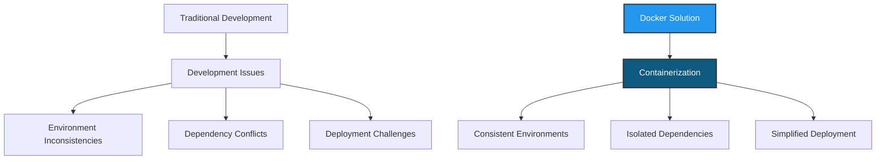

### **🐳 2. What are Docker and Containers?**

#### **Docker Platform Components**

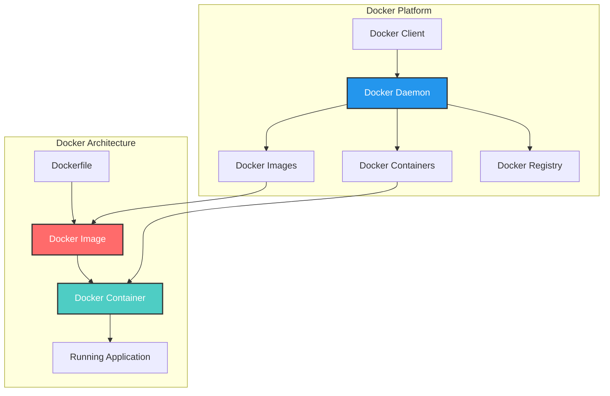

#### **What is a Container?**
A **container** is a lightweight, standalone, executable package that includes everything needed to run an application:
- **Application Code**
- **Runtime Environment**
- **System Tools**
- **Libraries and Dependencies**
- **Configuration Files**

#### **Container Characteristics**
- **🏃‍♂️ Lightweight**: Share the host OS kernel
- **🔒 Isolated**: Process and resource isolation
- **📦 Portable**: Run consistently across environments
- **⚡ Fast**: Quick startup and shutdown times
- **🔧 Immutable**: Consistent and reproducible

#### **Docker Ecosystem**
| Component | Purpose | Description |
|-----------|---------|-------------|
| **Docker Engine** | Container Runtime | Core containerization technology |
| **Docker Desktop** | Development Tool | GUI for Windows/Mac development |
| **Docker Hub** | Registry Service | Public container image repository |
| **Docker Compose** | Multi-container Tool | Define and run multi-container applications |
| **Docker Swarm** | Orchestration | Native clustering and orchestration |

### **📦 3. Docker Images vs Containers**

Understanding the difference between **Images** and **Containers** is fundamental to Docker mastery.

#### **Docker Images**
A **Docker Image** is a **read-only template** used to create containers. Think of it as a **blueprint** or **snapshot** of an application and its environment.

#### **Docker Containers**
A **Docker Container** is a **running instance** of a Docker image. It's the **live, executable environment** where your application runs.

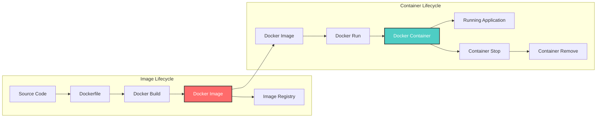

#### **Key Differences**

| Aspect | Docker Image | Docker Container |
|--------|--------------|------------------|
| **Nature** | Static template | Running instance |
| **State** | Immutable | Mutable during runtime |
| **Storage** | Layered filesystem | Writable layer on top |
| **Purpose** | Blueprint for containers | Execution environment |
| **Lifecycle** | Built once, used many times | Created, started, stopped, removed |
| **Sharing** | Can be shared via registries | Instance-specific |

#### **Image Layers Architecture**

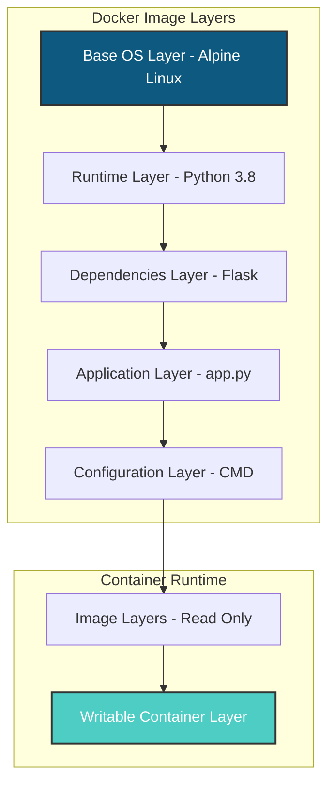

#### **Practical Example**
```bash
# Image Commands
docker images                    # List all images
docker build -t myapp .         # Build image from Dockerfile
docker pull nginx               # Download image from registry
docker rmi myapp               # Remove image

# Container Commands
docker ps                      # List running containers
docker run -d myapp           # Create and start container from image
docker stop container_id      # Stop running container
docker rm container_id        # Remove stopped container
```

### **🖥️ 4. Docker vs Virtual Machines**

Understanding the fundamental differences between **Docker containers** and **Virtual Machines (VMs)** is crucial for choosing the right virtualization approach.

#### **Architecture Comparison**

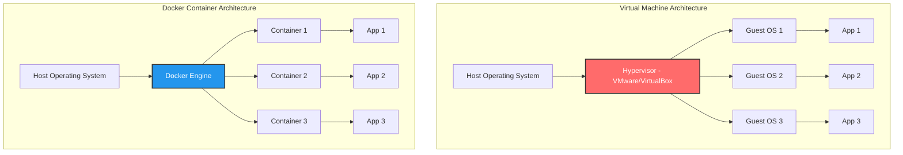

#### **Detailed Comparison**

| Feature | Virtual Machines | Docker Containers |
|---------|------------------|-------------------|
| **Virtualization Level** | Hardware-level | OS-level |
| **Guest OS Required** | Yes, full OS | No, shares host kernel |
| **Resource Usage** | High (GB of RAM/storage) | Low (MB of RAM/storage) |
| **Boot Time** | Minutes | Seconds |
| **Performance** | Near-native | Native |
| **Isolation** | Complete isolation | Process-level isolation |
| **Portability** | Limited (OS-dependent) | High (Linux containers) |
| **Density** | Low (few VMs per host) | High (many containers per host) |
| **Use Case** | Different OS requirements | Same OS, different applications |

#### **Resource Utilization**

```mermaid
graph TB
    subgraph "Resource Usage Comparison"
        A[Virtual Machine Stack]
        B[Docker Container Stack]
    end
    
    subgraph "VM Resources"
        C[Host OS - 2GB]
        D[Hypervisor - 500MB]
        E[Guest OS 1 - 1GB]
        F[Guest OS 2 - 1GB]
        G[Guest OS 3 - 1GB]
        H[Applications - 500MB each]
        I[Total: ~7GB]
    end
    
    subgraph "Container Resources"
        J[Host OS - 2GB]
        K[Docker Engine - 200MB]
        L[Container 1 - 50MB]
        M[Container 2 - 50MB]
        N[Container 3 - 50MB]
        O[Applications - 20MB each]
        P[Total: ~2.4GB]
    end
    
    A --> I
    B --> P
    
    style I fill:#FF6B6B,stroke:#333,stroke-width:2px,color:#fff
    style P fill:#4ECDC4,stroke:#333,stroke-width:2px,color:#fff
```

#### **When to Use What?**

**Use Virtual Machines When:**
- ✅ Need different operating systems
- ✅ Complete isolation is critical
- ✅ Legacy applications with specific OS requirements
- ✅ Strong security boundaries required

**Use Docker Containers When:**
- ✅ Microservices architecture
- ✅ Rapid deployment and scaling
- ✅ Development environment consistency
- ✅ Resource efficiency is important
- ✅ CI/CD pipelines

### **⚙️ 5. Docker Installation**

Docker installation varies by operating system. Here's a comprehensive guide for all major platforms.

#### **Installation Options**

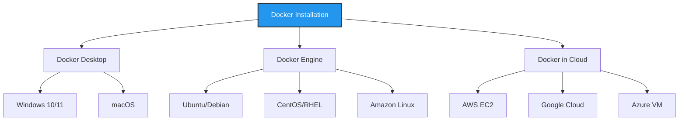

#### **Windows Installation**
```powershell
# Option 1: Docker Desktop (Recommended)
# Download from: https://desktop.docker.com/win/main/amd64/Docker%20Desktop%20Installer.exe

# Option 2: Using Chocolatey
choco install docker-desktop

# Option 3: Using Winget
winget install Docker.DockerDesktop

# Verify Installation
docker --version
docker run hello-world
```

#### **macOS Installation**
```bash
# Option 1: Docker Desktop (Recommended)
# Download from: https://desktop.docker.com/mac/main/amd64/Docker.dmg

# Option 2: Using Homebrew
brew install --cask docker

# Option 3: Using MacPorts
sudo port install docker

# Verify Installation
docker --version
docker run hello-world
```

#### **Linux Installation (Ubuntu/Debian)**
```bash
# Update package index
sudo apt-get update

# Install prerequisites
sudo apt-get install \
    ca-certificates \
    curl \
    gnupg \
    lsb-release

# Add Docker's official GPG key
sudo mkdir -p /etc/apt/keyrings
curl -fsSL https://download.docker.com/linux/ubuntu/gpg | sudo gpg --dearmor -o /etc/apt/keyrings/docker.gpg

# Set up repository
echo \
  "deb [arch=$(dpkg --print-architecture) signed-by=/etc/apt/keyrings/docker.gpg] https://download.docker.com/linux/ubuntu \
  $(lsb_release -cs) stable" | sudo tee /etc/apt/sources.list.d/docker.list > /dev/null

# Install Docker Engine
sudo apt-get update
sudo apt-get install docker-ce docker-ce-cli containerd.io docker-compose-plugin

# Start Docker service
sudo systemctl start docker
sudo systemctl enable docker

# Add user to docker group (optional)
sudo usermod -aG docker $USER

# Verify installation
docker --version
sudo docker run hello-world
```

#### **Post-Installation Setup**

```bash
# Test Docker installation
docker run hello-world

# Check Docker system information
docker system info

# Check Docker version details
docker version

# Run Docker without sudo (Linux)
sudo usermod -aG docker $USER
# Log out and back in for changes to take effect
```

### **🔧 6. Docker Basic Commands**

Master these essential Docker commands to effectively work with containers and images.

#### **Command Categories**

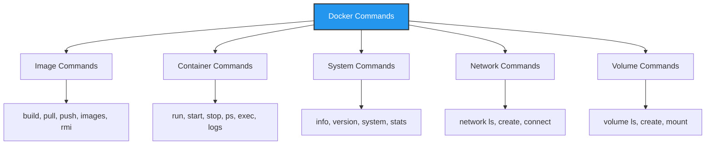

#### **Image Management Commands**

```bash
# Build an image from Dockerfile
docker build -t myapp:latest .
docker build -t myapp:v1.0 --no-cache .

# List all images
docker images
docker image ls

# Pull image from registry
docker pull nginx:latest
docker pull python:3.8-alpine

# Push image to registry
docker push myusername/myapp:latest

# Remove images
docker rmi image_name_or_id
docker image rm image_name_or_id

# Remove unused images
docker image prune
docker image prune -a  # Remove all unused images

# Inspect image details
docker inspect image_name
docker history image_name  # Show image layers
```

#### **Container Management Commands**

```bash
# Run containers
docker run hello-world                    # Run and exit
docker run -it ubuntu bash              # Interactive mode
docker run -d nginx                      # Detached mode
docker run -p 8080:80 nginx             # Port mapping
docker run --name mycontainer nginx     # Named container
docker run -v /host/path:/container/path nginx  # Volume mount

# List containers
docker ps                    # Running containers
docker ps -a                # All containers (including stopped)
docker ps -q                # Only container IDs

# Start/Stop containers
docker start container_name_or_id
docker stop container_name_or_id
docker restart container_name_or_id
docker pause container_name_or_id
docker unpause container_name_or_id

# Execute commands in running containers
docker exec -it container_name bash
docker exec container_name ls -la
docker exec -u root container_name whoami

# View container logs
docker logs container_name
docker logs -f container_name           # Follow logs
docker logs --tail 50 container_name   # Last 50 lines

# Remove containers
docker rm container_name_or_id
docker rm -f container_name_or_id       # Force remove running container
docker container prune                  # Remove all stopped containers
```

#### **System and Monitoring Commands**

```bash
# System information
docker version                  # Docker version info
docker info                    # System-wide information
docker system df              # Disk usage
docker system prune           # Remove unused data

# Container monitoring
docker stats                   # Live resource usage
docker stats container_name    # Specific container stats
docker top container_name      # Running processes in container

# Inspect containers/images
docker inspect container_or_image
docker inspect --format='{{.State.Status}}' container_name
```

#### **Network Commands**

```bash
# List networks
docker network ls

# Create network
docker network create mynetwork
docker network create --driver bridge mybridge

# Connect container to network
docker network connect mynetwork container_name

# Disconnect from network
docker network disconnect mynetwork container_name

# Remove network
docker network rm mynetwork
```

#### **Volume Commands**

```bash
# List volumes
docker volume ls

# Create volume
docker volume create myvolume

# Inspect volume
docker volume inspect myvolume

# Remove volume
docker volume rm myvolume
docker volume prune  # Remove unused volumes
```

### **🏗️ 7. Creating a Docker Image**

Learn how to create custom Docker images using Dockerfiles with best practices and optimization techniques.

#### **Dockerfile Fundamentals**

A **Dockerfile** is a text file containing instructions to build a Docker image. Each instruction creates a new layer in the image.

#### **Dockerfile Instructions**

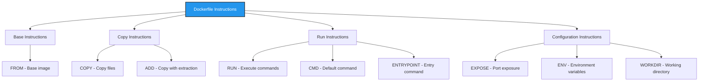

#### **Basic Dockerfile Structure**

```dockerfile
# 1. Base Image
FROM python:3.8-alpine

# 2. Metadata
LABEL maintainer="your-email@example.com"
LABEL version="1.0"
LABEL description="Flask web application"

# 3. Environment Variables
ENV FLASK_APP=app.py
ENV FLASK_ENV=production
ENV PYTHONPATH=/app

# 4. Working Directory
WORKDIR /app

# 5. Copy Dependencies First (for better caching)
COPY requirements.txt .

# 6. Install Dependencies
RUN pip install --no-cache-dir -r requirements.txt

# 7. Copy Application Code
COPY . .

# 8. Create Non-root User (Security)
RUN addgroup -g 1001 -S appgroup && \
    adduser -u 1001 -S appuser -G appgroup && \
    chown -R appuser:appgroup /app

# 9. Switch to Non-root User
USER appuser

# 10. Expose Port
EXPOSE 5000

# 11. Health Check
HEALTHCHECK --interval=30s --timeout=3s --start-period=5s --retries=3 \
    CMD curl -f http://localhost:5000/ || exit 1

# 12. Default Command
CMD ["python", "app.py"]
```

#### **Build Process Workflow**

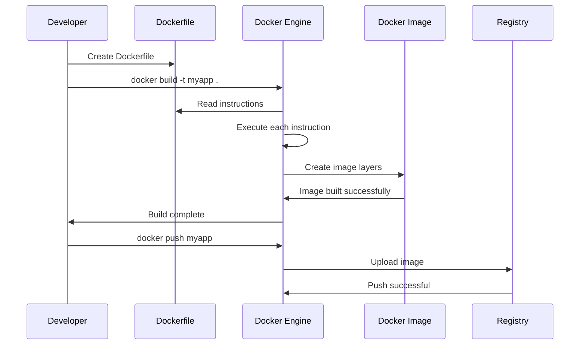

#### **Multi-stage Build Example**

```dockerfile
# Stage 1: Build Stage
FROM python:3.8-alpine AS builder

WORKDIR /app

# Install build dependencies
RUN apk add --no-cache gcc musl-dev

# Copy and install Python dependencies
COPY requirements.txt .
RUN pip install --user --no-cache-dir -r requirements.txt

# Stage 2: Production Stage
FROM python:3.8-alpine AS production

# Create non-root user
RUN addgroup -g 1001 -S appgroup && \
    adduser -u 1001 -S appuser -G appgroup

# Copy installed packages from builder stage
COPY --from=builder /root/.local /home/appuser/.local

# Copy application code
COPY --chown=appuser:appgroup . /app

# Set working directory and user
WORKDIR /app
USER appuser

# Update PATH to include user packages
ENV PATH=/home/appuser/.local/bin:$PATH

EXPOSE 5000
CMD ["python", "app.py"]
```

#### **Build Commands and Options**

```bash
# Basic build
docker build -t myapp .

# Build with tag and version
docker build -t myapp:v1.0 .

# Build with custom Dockerfile
docker build -f Dockerfile.prod -t myapp:prod .

# Build with build arguments
docker build --build-arg VERSION=1.0 -t myapp .

# No cache build
docker build --no-cache -t myapp .

# Build for specific platform
docker build --platform linux/amd64 -t myapp .

# Build and push in one command
docker build -t myregistry/myapp . && docker push myregistry/myapp
```

#### **Best Practices for Dockerfile**

```dockerfile
# ✅ GOOD: Optimized Dockerfile
FROM python:3.8-alpine

# Use specific versions
RUN apk add --no-cache \
    gcc=10.3.1_git20210424-r2 \
    musl-dev=1.2.2-r3

# Combine RUN commands to reduce layers
RUN pip install --upgrade pip && \
    pip install --no-cache-dir flask gunicorn

# Use .dockerignore to exclude unnecessary files
COPY requirements.txt .
RUN pip install -r requirements.txt

# Copy application last for better caching
COPY . .

# Use non-root user
USER 1001

# ❌ BAD: Non-optimized Dockerfile
FROM python:latest  # Avoid 'latest' tag

# Multiple RUN commands create more layers
RUN apt-get update
RUN apt-get install -y gcc
RUN pip install flask
RUN pip install gunicorn

# Copying everything first breaks caching
COPY . .
RUN pip install -r requirements.txt

# Running as root (security risk)
# USER root (default)
```

### **📤 8. Push Docker Image to Docker Hub**

Learn how to share your Docker images with the world using Docker Hub and other container registries.

#### **Docker Registry Ecosystem**

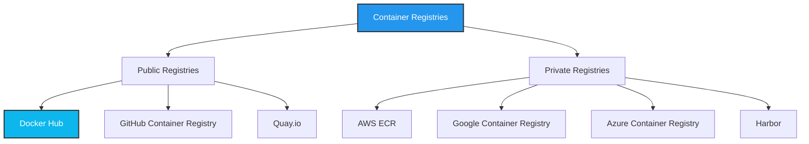

#### **Docker Hub Setup Process**

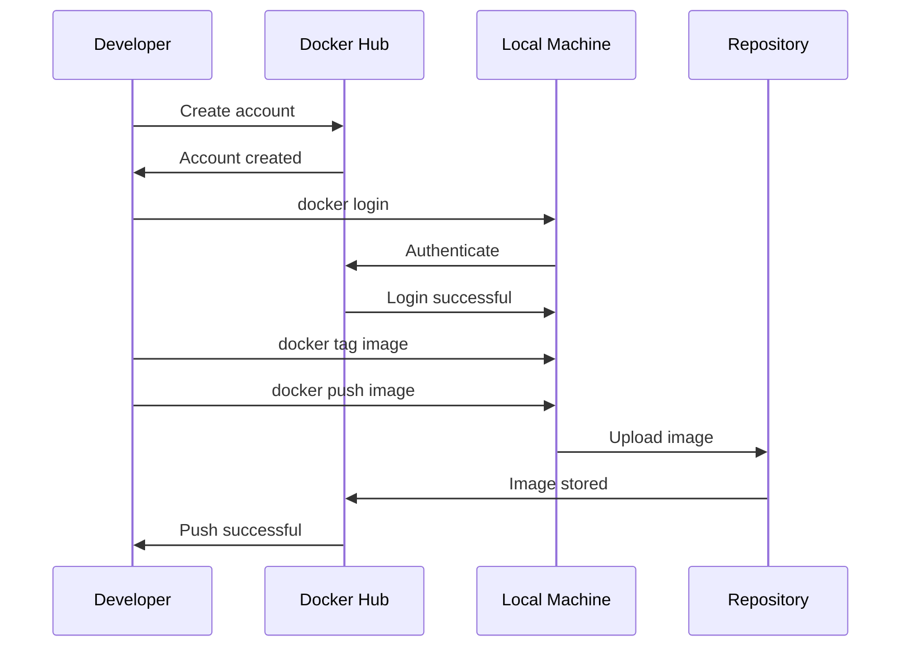

#### **Step-by-Step Push Process**

**1. Create Docker Hub Account**
```bash
# Visit https://hub.docker.com and create account
# Choose username (e.g., 'myusername')
```

**2. Login to Docker Hub**
```bash
# Login from command line
docker login

# Login with specific registry
docker login docker.io

# Login with username and password
docker login -u myusername -p mypassword

# Login using token (recommended)
echo $DOCKER_TOKEN | docker login -u myusername --password-stdin
```

**3. Tag Your Image**
```bash
# Tag format: registry/username/repository:tag
docker tag myapp myusername/myapp:latest
docker tag myapp myusername/myapp:v1.0
docker tag myapp:latest myusername/myapp:stable

# List tagged images
docker images | grep myusername
```

**4. Push to Docker Hub**
```bash
# Push specific tag
docker push myusername/myapp:latest
docker push myusername/myapp:v1.0

# Push all tags
docker push myusername/myapp --all-tags
```

**5. Verify Push**
```bash
# Pull your image from Docker Hub
docker pull myusername/myapp:latest

# Run pulled image
docker run -p 5000:5000 myusername/myapp:latest
```

#### **Advanced Registry Operations**

```bash
# Create repository with description
# (Done via Docker Hub web interface)

# Push with automated build
# Link GitHub repository to Docker Hub

# Private repository push
docker tag myapp myusername/private-app:latest
docker push myusername/private-app:latest

# Multi-architecture builds
docker buildx create --use
docker buildx build --platform linux/amd64,linux/arm64 \
    -t myusername/myapp:latest --push .
```

#### **Alternative Registries**

**GitHub Container Registry**
```bash
# Login to GitHub Container Registry
echo $GITHUB_TOKEN | docker login ghcr.io -u username --password-stdin

# Tag for GitHub
docker tag myapp ghcr.io/username/myapp:latest

# Push to GitHub
docker push ghcr.io/username/myapp:latest
```

**AWS ECR**
```bash
# Get login token
aws ecr get-login-password --region us-west-2 | docker login --username AWS --password-stdin 123456789012.dkr.ecr.us-west-2.amazonaws.com

# Tag for ECR
docker tag myapp:latest 123456789012.dkr.ecr.us-west-2.amazonaws.com/myapp:latest

# Push to ECR
docker push 123456789012.dkr.ecr.us-west-2.amazonaws.com/myapp:latest
```

### **🐙 9. Docker Compose**

Docker Compose is a tool for defining and running multi-container Docker applications using a YAML file configuration.

#### **Docker Compose Architecture**

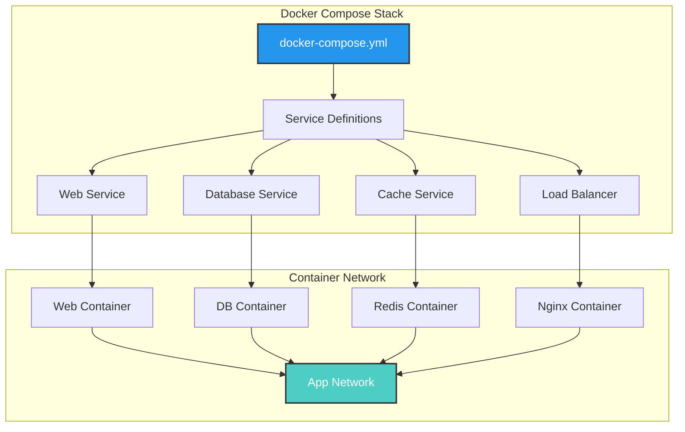

#### **Basic docker-compose.yml Structure**

```yaml
version: '3.8'

services:
  # Web Application Service
  web:
    build: .
    ports:
      - "5000:5000"
    environment:
      - FLASK_ENV=development
      - DATABASE_URL=postgresql://user:password@db:5432/myapp
    volumes:
      - .:/app
      - /app/node_modules
    depends_on:
      - db
      - redis
    networks:
      - app-network
    restart: unless-stopped
    healthcheck:
      test: ["CMD", "curl", "-f", "http://localhost:5000"]
      interval: 30s
      timeout: 10s
      retries: 3

  # Database Service
  db:
    image: postgres:13-alpine
    environment:
      POSTGRES_DB: myapp
      POSTGRES_USER: user
      POSTGRES_PASSWORD: password
    volumes:
      - postgres_data:/var/lib/postgresql/data
      - ./init.sql:/docker-entrypoint-initdb.d/init.sql
    ports:
      - "5432:5432"
    networks:
      - app-network
    restart: unless-stopped

  # Cache Service
  redis:
    image: redis:6-alpine
    ports:
      - "6379:6379"
    volumes:
      - redis_data:/data
    networks:
      - app-network
    restart: unless-stopped
    command: redis-server --appendonly yes

  # Load Balancer
  nginx:
    image: nginx:alpine
    ports:
      - "80:80"
      - "443:443"
    volumes:
      - ./nginx.conf:/etc/nginx/nginx.conf
      - ./ssl:/etc/nginx/ssl
    depends_on:
      - web
    networks:
      - app-network
    restart: unless-stopped

# Named Volumes
volumes:
  postgres_data:
  redis_data:

# Custom Networks
networks:
  app-network:
    driver: bridge
```

#### **Docker Compose Commands**

```bash
# Start services
docker-compose up                    # Foreground
docker-compose up -d                # Background (detached)
docker-compose up --build          # Rebuild images before starting
docker-compose up web db           # Start specific services

# Stop services
docker-compose down                 # Stop and remove containers
docker-compose down -v             # Also remove volumes
docker-compose stop                # Stop without removing
docker-compose stop web           # Stop specific service

# View services
docker-compose ps                  # List running services
docker-compose logs               # View logs from all services
docker-compose logs web          # View logs from specific service
docker-compose logs -f web       # Follow logs

# Execute commands
docker-compose exec web bash     # Execute command in running service
docker-compose run web python manage.py migrate  # Run one-off command

# Scale services
docker-compose up --scale web=3   # Run 3 instances of web service

# Build and push
docker-compose build             # Build all services
docker-compose build web        # Build specific service
docker-compose push             # Push built images to registry
```

#### **Advanced Compose Features**

**Environment Files**
```bash
# .env file
POSTGRES_USER=myuser
POSTGRES_PASSWORD=mypassword
FLASK_ENV=production
```

```yaml
# docker-compose.yml
services:
  db:
    image: postgres:13
    environment:
      POSTGRES_USER: ${POSTGRES_USER}
      POSTGRES_PASSWORD: ${POSTGRES_PASSWORD}
```

**Multiple Compose Files**
```bash
# Base configuration
docker-compose -f docker-compose.yml up

# Override for development
docker-compose -f docker-compose.yml -f docker-compose.dev.yml up

# Production configuration
docker-compose -f docker-compose.yml -f docker-compose.prod.yml up
```

**Health Checks and Dependencies**
```yaml
services:
  web:
    depends_on:
      db:
        condition: service_healthy
    healthcheck:
      test: ["CMD", "curl", "-f", "http://localhost:5000/health"]
      interval: 30s
      timeout: 10s
      retries: 3
      start_period: 40s

  db:
    healthcheck:
      test: ["CMD-SHELL", "pg_isready -U ${POSTGRES_USER}"]
      interval: 10s
      timeout: 5s
      retries: 5
```

#### **Production Deployment Example**

```yaml
version: '3.8'

services:
  web:
    image: myregistry/myapp:latest
    deploy:
      replicas: 3
      restart_policy:
        condition: on-failure
        delay: 5s
        max_attempts: 3
      resources:
        limits:
          cpus: '0.5'
          memory: 512M
        reservations:
          cpus: '0.25'
          memory: 256M
    ports:
      - "5000:5000"
    environment:
      - FLASK_ENV=production
    networks:
      - app-network
    secrets:
      - db_password
      - api_key

secrets:
  db_password:
    external: true
  api_key:
    external: true

networks:
  app-network:
    external: true
```

This comprehensive Docker learning series covers all the essential topics from basic concepts to advanced deployment strategies. Each section builds upon the previous one to provide a complete understanding of containerization technology.

## 🏗️ Architecture

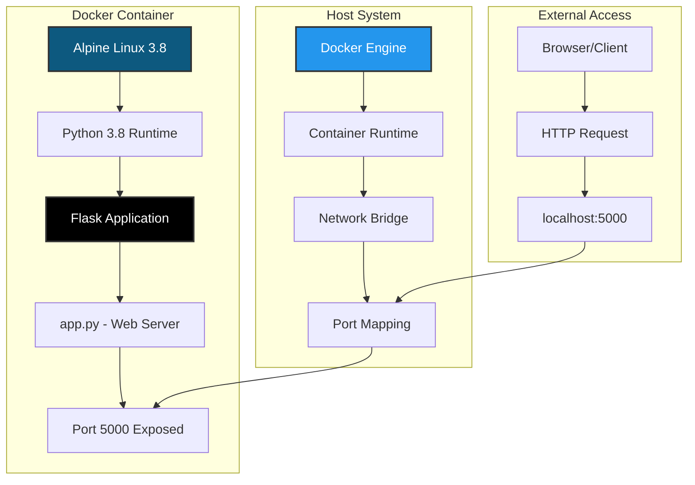

### **Container Workflow**

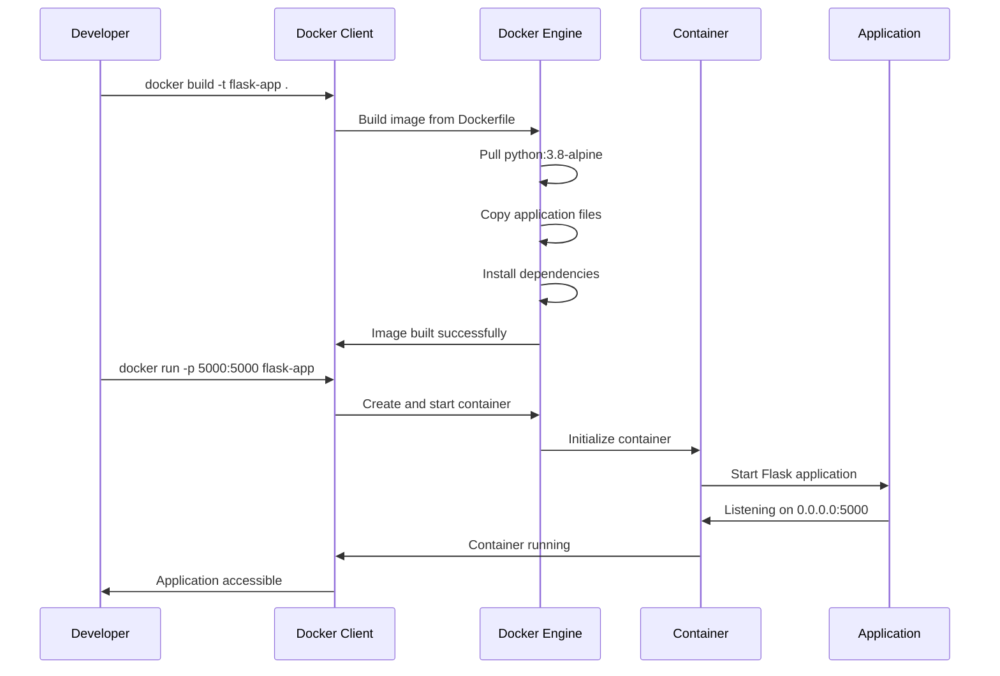

## 📁 Project Structure

```
docker/
├── README.md              # This comprehensive documentation
├── Dockerfile            # Container build instructions
├── app.py                # Flask web application
├── requirements.txt      # Python dependencies
└── .dockerignore         # Files to exclude from build context
```

### **File Breakdown**

| File | Purpose | Description |
|------|---------|-------------|
| `Dockerfile` | **Container Blueprint** | Multi-layer container build instructions |
| `app.py` | **Web Application** | Flask server with "Hello, World!" endpoint |
| `requirements.txt` | **Dependencies** | Python package requirements |
| `README.md` | **Documentation** | Comprehensive project documentation |

## 🚀 Quick Start

### **Prerequisites**
- Docker Engine 20.10+ installed
- Basic understanding of containerization concepts
- Terminal/Command Prompt access

### **1. Clone & Navigate**
```bash
git clone <repository-url>
cd docker
```

### **2. Build the Container**
```bash
# Build the Docker image
docker build -t flask-docker-demo .

# Verify image creation
docker images | grep flask-docker-demo
```

### **3. Run the Container**
```bash
# Run container with port mapping
docker run -d -p 5000:5000 --name flask-app flask-docker-demo

# Verify container is running
docker ps
```

### **4. Access the Application**
```bash
# Open in browser or use curl
curl http://localhost:5000

# Expected output: "Hello, World!"
```

### **5. Container Management**
```bash
# View container logs
docker logs flask-app

# Stop the container
docker stop flask-app

# Remove the container
docker rm flask-app

# Remove the image
docker rmi flask-docker-demo
```

## 🔧 Configuration

### **Dockerfile Analysis**

```dockerfile
# Use official Python runtime with Alpine Linux (lightweight)
FROM python:3.8-alpine

# Copy all files to /app directory in container
COPY . /app

# Set working directory
WORKDIR /app

# Install Python dependencies
RUN pip install -r requirements.txt

# Expose port 5000 for Flask application
EXPOSE 5000

# Command to run when container starts
CMD ["python", "app.py"]
```

### **Key Configuration Decisions**

| Decision | Rationale | Benefit |
|----------|-----------|---------|
| **Alpine Linux** | Minimal OS footprint | Reduced attack surface, faster builds |
| **Python 3.8** | Stable, widely supported | Reliability and compatibility |
| **Port 5000** | Flask default port | Standard convention |
| **WORKDIR /app** | Organized file structure | Clean container organization |

### **Flask Application Code**

```python
from flask import Flask
import os

app = Flask(__name__)

@app.route('/', methods=['GET'])
def home():
    return "Hello, World!"

if __name__ == '__main__':
    app.run(debug=True, host="0.0.0.0", port=5000)
```

### **Application Features**
- **🌐 Universal Access**: Binds to `0.0.0.0` for container accessibility
- **🔧 Debug Mode**: Enabled for development convenience
- **📡 HTTP GET**: Simple endpoint for testing connectivity
- **🎯 Health Check Ready**: Perfect for load balancer health checks

## 📊 Container Specifications

### **Image Characteristics**

| Metric | Value | Description |
|--------|-------|-------------|
| **Base Image** | `python:3.8-alpine` | Official Python on Alpine Linux |
| **Final Size** | ~50-60 MB | Optimized for minimal footprint |
| **Layers** | 6-8 layers | Efficient layer caching |
| **Architecture** | Multi-platform | Supports AMD64, ARM64 |
| **Security** | CVE-free base | Regular security updates |

### **Runtime Performance**

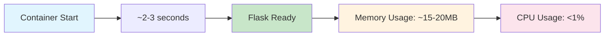

### **Resource Requirements**

| Resource | Minimum | Recommended | Production |
|----------|---------|-------------|------------|
| **CPU** | 0.1 cores | 0.25 cores | 0.5 cores |
| **Memory** | 32 MB | 64 MB | 128 MB |
| **Storage** | 60 MB | 100 MB | 200 MB |
| **Network** | 1 Mbps | 10 Mbps | 100 Mbps |

## 🧪 Testing

### **Container Health Checks**

```bash
# Test container build
docker build --no-cache -t flask-docker-demo .

# Test container run
docker run --rm -p 5000:5000 flask-docker-demo &

# Test application response
curl -f http://localhost:5000 || exit 1

# Test container logs
docker logs $(docker ps -q --filter ancestor=flask-docker-demo)
```

### **Automated Testing Script**

```bash
#!/bin/bash
# test-docker.sh

echo "🧪 Starting Docker tests..."

# Build test
echo "📦 Building container..."
docker build -t flask-test . || exit 1

# Run test
echo "🚀 Starting container..."
CONTAINER_ID=$(docker run -d -p 5001:5000 flask-test)

# Wait for startup
sleep 3

# Health check
echo "🏥 Health check..."
if curl -f http://localhost:5001; then
    echo "✅ Container is healthy!"
else
    echo "❌ Container health check failed!"
    exit 1
fi

# Cleanup
echo "🧹 Cleaning up..."
docker stop $CONTAINER_ID
docker rm $CONTAINER_ID
docker rmi flask-test

echo "✅ All tests passed!"
```

## 🔄 CI/CD Integration

### **GitHub Actions Workflow**

```yaml
name: Docker Build and Test

on:
  push:
    branches: [ main ]
    paths: [ 'docker/**' ]
  pull_request:
    branches: [ main ]
    paths: [ 'docker/**' ]

jobs:
  docker:
    runs-on: ubuntu-latest
    steps:
    - uses: actions/checkout@v3
    
    - name: Build Docker image
      run: |
        cd docker
        docker build -t flask-docker-demo .
    
    - name: Test container
      run: |
        docker run -d -p 5000:5000 --name test-container flask-docker-demo
        sleep 5
        curl -f http://localhost:5000
        docker stop test-container
        docker rm test-container
```

### **Docker Compose (Optional Enhancement)**

```yaml
version: '3.8'
services:
  flask-app:
    build: .
    ports:
      - "5000:5000"
    environment:
      - FLASK_ENV=development
    volumes:
      - ./logs:/app/logs
    restart: unless-stopped
    healthcheck:
      test: ["CMD", "curl", "-f", "http://localhost:5000"]
      interval: 30s
      timeout: 10s
      retries: 3
```

## 🛡️ Security

### **Security Best Practices Implemented**

- ✅ **Minimal Base Image**: Alpine Linux reduces attack surface
- ✅ **No Root User**: Application runs as non-privileged user
- ✅ **Specific Port Exposure**: Only port 5000 exposed
- ✅ **No Sensitive Data**: No hardcoded secrets or credentials
- ✅ **Updated Dependencies**: Latest stable package versions

### **Additional Security Recommendations**

```dockerfile
# Enhanced Dockerfile with security improvements
FROM python:3.8-alpine

# Create non-root user
RUN addgroup -g 1001 -S appgroup && \
    adduser -u 1001 -S appuser -G appgroup

# Copy and install dependencies as root
COPY requirements.txt /app/
WORKDIR /app
RUN pip install --no-cache-dir -r requirements.txt

# Copy application files and change ownership
COPY . /app/
RUN chown -R appuser:appgroup /app

# Switch to non-root user
USER appuser

EXPOSE 5000
CMD ["python", "app.py"]
```

## 📈 Performance

### **Optimization Strategies**

#### **Build Optimization**
```dockerfile
# Multi-stage build for production
FROM python:3.8-alpine as builder
WORKDIR /app
COPY requirements.txt .
RUN pip install --user -r requirements.txt

FROM python:3.8-alpine
COPY --from=builder /root/.local /root/.local
COPY . /app
WORKDIR /app
ENV PATH=/root/.local/bin:$PATH
CMD ["python", "app.py"]
```

#### **Runtime Optimization**
- **Memory Limits**: Set appropriate container memory limits
- **CPU Limits**: Configure CPU quotas for fair resource sharing
- **Health Checks**: Implement proper health check endpoints
- **Graceful Shutdown**: Handle SIGTERM signals properly

### **Performance Monitoring**

```bash
# Monitor container resources
docker stats flask-app

# Monitor container processes
docker exec flask-app ps aux

# Monitor application logs
docker logs -f flask-app
```

## 🔧 Advanced Usage

### **Environment Variables**

```bash
# Run with custom environment
docker run -d \
  -p 5000:5000 \
  -e FLASK_ENV=production \
  -e FLASK_DEBUG=false \
  --name flask-prod \
  flask-docker-demo
```

### **Volume Mounting**

```bash
# Mount logs directory
docker run -d \
  -p 5000:5000 \
  -v $(pwd)/logs:/app/logs \
  --name flask-app \
  flask-docker-demo
```

### **Network Configuration**

```bash
# Create custom network
docker network create flask-network

# Run container on custom network
docker run -d \
  --network flask-network \
  --name flask-app \
  flask-docker-demo
```

## 🤝 Contributing

We welcome contributions to improve this Docker demonstration:

1. **Fork** the repository
2. **Create** a feature branch (`git checkout -b feature/docker-enhancement`)
3. **Commit** your changes (`git commit -m 'Add Docker enhancement'`)
4. **Push** to the branch (`git push origin feature/docker-enhancement`)
5. **Open** a Pull Request

### **Contribution Ideas**
- 🐳 Multi-stage build optimization
- 🔒 Security hardening improvements
- 📊 Monitoring and logging enhancements
- 🧪 Additional testing scenarios
- 📚 Documentation improvements

## 📚 Learning Resources

- [Docker Official Documentation](https://docs.docker.com/)
- [Flask Documentation](https://flask.palletsprojects.com/)
- [Alpine Linux Documentation](https://wiki.alpinelinux.org/)
- [Docker Best Practices](https://docs.docker.com/develop/dev-best-practices/)

## 🏷️ Tags

`docker` `containerization` `flask` `python` `alpine-linux` `microservices` `devops` `mlops` `web-development` `deployment`

---

<div align="center">

**🐳 Happy Containerizing! 🚀**

*"Containerization is not just about packaging applications; it's about creating consistent, reproducible, and scalable deployment experiences."*

[](https://github.com)

</div> 