# ☁️ MLflow on AWS - Enterprise MLOps Infrastructure

[](https://aws.amazon.com)
[](https://mlflow.org)
[](https://aws.amazon.com/ec2/)
[](https://aws.amazon.com/s3/)
[](https://aws.amazon.com/iam/)
[](https://ubuntu.com)

[](.)
[](.)
[](.)

> **🚨 COST NOTICE**: For cost-effectiveness and to avoid ongoing AWS charges, all AWS resources (S3 buckets, EC2 instances, and related infrastructure) have been terminated after completing this demonstration. This repository serves as a comprehensive guide for setting up your own MLflow on AWS infrastructure.

---

## 🎯 Overview

This project demonstrates **enterprise-grade MLOps infrastructure** using **MLflow on AWS**, providing scalable experiment tracking, centralized artifact storage, and collaborative machine learning workflows in the cloud.

### **🏗️ Architecture Diagram**

```mermaid
graph TB
    subgraph "🖥️ Local Development Environment"
        A[Python ML Scripts] --> B[MLflow Client Library]
        B --> C[Experiment Logging API]
        C --> D[Model Artifacts]
    end
    
    subgraph "☁️ AWS Cloud Infrastructure"
        E[🖥️ EC2 Ubuntu Instance] --> F[🔬 MLflow Tracking Server]
        F --> G[📊 Experiment Database]
        F --> H[📦 S3 Artifact Store]
        H --> I[🤖 ML Models]
        H --> J[📈 Metrics & Parameters]
        H --> K[📋 Experiment Metadata]
    end
    
    subgraph "🔐 Security & Access Control"
        L[👤 IAM User] --> M[🔑 AWS CLI Configuration]
        M --> N[🛡️ Security Groups]
        N --> O[🌐 Port 5000 Access]
    end
    
    subgraph "🌐 Network Configuration"
        P[🌍 Public IPv4 DNS] --> Q[🔗 MLflow UI Access]
        Q --> R[📱 Web Dashboard]
    end
    
    C --> F
    L --> E
    E --> P
    
    style E fill:#ff9900,stroke:#333,stroke-width:3px,color:#fff
    style H fill:#569A31,stroke:#333,stroke-width:3px,color:#fff
    style F fill:#0194E2,stroke:#333,stroke-width:3px,color:#fff
    style L fill:#FF9900,stroke:#333,stroke-width:2px,color:#fff
```



---

## 📋 Table of Contents

- [🎯 Overview](#-overview)
- [🏗️ Infrastructure Components](#️-infrastructure-components)
- [⚙️ Prerequisites](#️-prerequisites)
- [🚀 Complete Setup Guide](#-complete-setup-guide)
- [🔧 Configuration Details](#-configuration-details)
- [🧪 Testing & Validation](#-testing--validation)
- [💰 Cost Management](#-cost-management)
- [🔒 Security Best Practices](#-security-best-practices)
- [🎓 Learning Outcomes](#-learning-outcomes)

---

## 🏗️ Infrastructure Components

### **☁️ AWS Services Used**

| Service | Purpose | Configuration |
|---------|---------|---------------|
|  | **Compute Instance** | Ubuntu Server, t2.micro/small |
|  | **Artifact Storage** | MLflow model & experiment storage |
|  | **Access Control** | User permissions & security policies |
|  | **Network Security** | Security groups & firewall rules |

### **🛠️ Technology Stack**


---

## ⚙️ Prerequisites

### **🔧 Required Tools & Accounts**

- ✅ **AWS Account** with billing enabled
- ✅ **AWS CLI** installed and configured
- ✅ **Python 3.8+** development environment
- ✅ **SSH Client** for EC2 access
- ✅ **Basic Linux** command line knowledge

### **💳 AWS Permissions Required**

```json
{
    "Version": "2012-10-17",
    "Statement": [
        {
            "Effect": "Allow",
            "Action": [
                "ec2:*",
                "s3:*",
                "iam:*"
            ],
            "Resource": "*"
        }
    ]
}
```

---

## 🚀 Complete Setup Guide

### **Phase 1: 🔐 AWS Account & IAM Configuration**

#### **Step 1.1: AWS Console Setup**
1. **Login to AWS Console** → [AWS Management Console](https://aws.amazon.com/console/)
2. **Navigate to IAM** → Users → Create User
3. **Configure User**:
   - Username: `mlflow-admin`
   - Access Type: ✅ Programmatic access
   - Permissions: ✅ AdministratorAccess policy

#### **Step 1.2: Local AWS CLI Configuration**
```bash
# Install AWS CLI (if not already installed)
pip install awscli

# Configure AWS credentials
aws configure
# AWS Access Key ID: [Your Access Key from IAM]
# AWS Secret Access Key: [Your Secret Key from IAM]
# Default region name: us-east-1 (or your preferred region)
# Default output format: json
```

### **Phase 2: 📦 S3 Bucket Creation**

#### **Step 2.1: Create S3 Bucket**
```bash
# Create S3 bucket for MLflow artifacts
aws s3 mb s3://mlflowtracking007 --region us-east-1

# Verify bucket creation
aws s3 ls | grep mlflowtracking007
```

#### **Step 2.2: Configure Bucket Policies** (Optional)
```json
{
    "Version": "2012-10-17",
    "Statement": [
        {
            "Sid": "MLflowAccess",
            "Effect": "Allow",
            "Principal": {
                "AWS": "arn:aws:iam::YOUR-ACCOUNT-ID:user/mlflow-admin"
            },
            "Action": "s3:*",
            "Resource": [
                "arn:aws:s3:::mlflowtracking007",
                "arn:aws:s3:::mlflowtracking007/*"
            ]
        }
    ]
}
```

### **Phase 3: 🖥️ EC2 Instance Setup**

#### **Step 3.1: Launch EC2 Instance**

**Instance Configuration:**
- **AMI**: Ubuntu Server 20.04 LTS (Free Tier Eligible)
- **Instance Type**: t2.micro (Free Tier) or t2.small (Recommended)
- **Key Pair**: Create new or use existing
- **Security Group**: Create new with following rules:

| Type | Protocol | Port | Source | Description |
|------|----------|------|--------|-------------|
| SSH | TCP | 22 | Your IP | SSH Access |
| Custom TCP | TCP | 5000 | 0.0.0.0/0 | MLflow UI |
| HTTP | TCP | 80 | 0.0.0.0/0 | Web Access |
| HTTPS | TCP | 443 | 0.0.0.0/0 | Secure Web |

#### **Step 3.2: Connect to EC2 Instance**
```bash
# Connect via SSH
ssh -i "your-key-pair.pem" ubuntu@your-ec2-public-ip

# Or use AWS Systems Manager Session Manager (recommended)
aws ssm start-session --target i-1234567890abcdef0
```

### **Phase 4: 🐍 EC2 Environment Setup**

#### **Step 4.1: System Updates & Dependencies**
```bash
# Update system packages
sudo apt update

# Install Python package manager
sudo apt install python3-pip

# Install virtual environment tools
sudo apt install pipenv

# Install additional virtual environment support
sudo apt install virtualenv

# Verify installations
python3 --version
pip3 --version
pipenv --version
```

#### **Step 4.2: MLflow Project Structure**
```bash
# Create project directory
mkdir mlflow
cd mlflow

# Initialize Python environment with pipenv
pipenv install mlflow

# Install AWS integration packages
pipenv install awscli

# Install Python AWS SDK
pipenv install boto3

# Activate virtual environment
pipenv shell
```

#### **Step 4.3: AWS Credentials on EC2**
```bash
# Configure AWS credentials on EC2 instance
aws configure
# Use the same credentials configured locally
# AWS Access Key ID: [Your Access Key]
# AWS Secret Access Key: [Your Secret Key]
# Default region name: us-east-1
# Default output format: json

# Verify AWS configuration
aws sts get-caller-identity
aws s3 ls s3://mlflowtracking007
```

### **Phase 5: 🔬 MLflow Server Deployment**

#### **Step 5.1: Launch MLflow Server**
```bash
# Start MLflow server with S3 backend storage
mlflow server -h 0.0.0.0 --default-artifact-root s3://mlflowtracking007

# Server will start and display:
# [INFO] Starting gunicorn 20.1.0
# [INFO] Listening at: http://0.0.0.0:5000
# [INFO] Using worker: sync
```

#### **Step 5.2: Access MLflow UI**
```bash
# MLflow UI will be accessible at:
# http://[EC2-Public-IPv4-DNS]:5000
# Example: http://ec2-13-203-223-225.ap-south-1.compute.amazonaws.com:5000

# Get your EC2 public DNS
curl http://169.254.169.254/latest/meta-data/public-hostname
```

---

## 🔧 Configuration Details

### **🖥️ Local Development Setup**

#### **Environment Configuration**
```bash
# Set MLflow tracking URI to point to AWS server
export MLFLOW_TRACKING_URI=http://ec2-13-203-223-225.ap-south-1.compute.amazonaws.com:5000/

# Make it permanent (add to ~/.bashrc or ~/.zshrc)
echo 'export MLFLOW_TRACKING_URI=http://ec2-13-203-223-225.ap-south-1.compute.amazonaws.com:5000/' >> ~/.bashrc
source ~/.bashrc

# Verify connection
mlflow experiments list
```

#### **Python Application Integration**
```python
import mlflow
import mlflow.sklearn
import os
from sklearn.ensemble import RandomForestClassifier
from sklearn.metrics import accuracy_score

# Configure MLflow tracking URI
os.environ['MLFLOW_TRACKING_URI'] = 'http://ec2-13-203-223-225.ap-south-1.compute.amazonaws.com:5000/'

# Start MLflow experiment
with mlflow.start_run():
    # Your ML code here
    model = RandomForestClassifier(n_estimators=100)
    
    # Log parameters
    mlflow.log_param("n_estimators", 100)
    mlflow.log_param("algorithm", "RandomForest")
    
    # Log metrics
    mlflow.log_metric("accuracy", 0.95)
    mlflow.log_metric("precision", 0.92)
    
    # Log model
    mlflow.sklearn.log_model(model, "random_forest_model")
    
    # Log artifacts
    mlflow.log_artifact("data/training_data.csv")
```

---

## 🧪 Testing & Validation

### **🔍 System Health Checks**

#### **EC2 Instance Validation**
```bash
# Check system resources
htop
df -h
free -h

# Check MLflow server process
ps aux | grep mlflow
netstat -tlnp | grep :5000
```

#### **S3 Integration Testing**
```bash
# Test S3 connectivity
aws s3 ls s3://mlflowtracking007

# Upload test file
echo "MLflow Test" > test.txt
aws s3 cp test.txt s3://mlflowtracking007/test/
aws s3 ls s3://mlflowtracking007/test/
```

#### **MLflow Functionality Test**
```python
import mlflow
import requests

# Test MLflow server connectivity
response = requests.get('http://ec2-13-203-223-225.ap-south-1.compute.amazonaws.com:5000/health')
print(f"MLflow Server Status: {response.status_code}")

# Test experiment creation
mlflow.set_tracking_uri('http://ec2-13-203-223-225.ap-south-1.compute.amazonaws.com:5000/')
experiment_id = mlflow.create_experiment("AWS_Test_Experiment")
print(f"Created Experiment ID: {experiment_id}")
```

---

## 💰 Cost Management

### **💡 Cost Optimization Strategies**

#### **🔄 Resource Management**


#### **📊 Cost Breakdown**

| Resource | Estimated Monthly Cost | Optimization |
|----------|----------------------|--------------|
| **EC2 t2.micro** | $0 (Free Tier) | ✅ Free for 12 months |
| **EC2 t2.small** | ~$17/month | 🔄 Use only when needed |
| **S3 Storage** | ~$0.023/GB | 📦 Lifecycle policies |
| **Data Transfer** | $0.09/GB | 🌐 Regional optimization |

### **🚨 Cost Alert Setup**
```bash
# Create billing alert
aws budgets create-budget \
    --account-id YOUR-ACCOUNT-ID \
    --budget '{
        "BudgetName": "MLflow-AWS-Budget",
        "BudgetLimit": {
            "Amount": "10",
            "Unit": "USD"
        },
        "TimeUnit": "MONTHLY",
        "BudgetType": "COST"
    }'
```

---

## 🔒 Security Best Practices

### **🛡️ Security Checklist**

- ✅ **IAM Least Privilege**: Only necessary permissions
- ✅ **Security Groups**: Restrict port 5000 to specific IPs
- ✅ **SSH Key Management**: Secure key pair storage
- ✅ **S3 Bucket Policies**: Restrict access to MLflow artifacts
- ✅ **VPC Configuration**: Network isolation
- ✅ **CloudTrail Logging**: Audit trail for all actions

### **🔐 Enhanced Security Configuration**

#### **Security Group Rules (Recommended)**
```bash
# Create restrictive security group
aws ec2 create-security-group \
    --group-name mlflow-secure-sg \
    --description "Secure MLflow Server Access"

# Add SSH access from your IP only
aws ec2 authorize-security-group-ingress \
    --group-name mlflow-secure-sg \
    --protocol tcp \
    --port 22 \
    --cidr YOUR-IP/32

# Add MLflow UI access from specific IPs
aws ec2 authorize-security-group-ingress \
    --group-name mlflow-secure-sg \
    --protocol tcp \
    --port 5000 \
    --cidr YOUR-OFFICE-IP/24
```

---

## 🎓 Learning Outcomes

### **📚 Skills Acquired**

By completing this AWS MLflow setup, you will have learned:

- ✅ **Cloud Infrastructure Management** with AWS
- ✅ **MLflow Server Configuration** for production environments
- ✅ **S3 Integration** for scalable artifact storage
- ✅ **Security Best Practices** for cloud deployments
- ✅ **Cost Optimization** strategies for AWS resources
- ✅ **Remote Experiment Tracking** workflows
- ✅ **Enterprise MLOps** architecture patterns

### **🚀 Next Steps**

1. **🔄 Implement CI/CD** pipelines with MLflow
2. **📊 Add Database Backend** (RDS) for production
3. **🔧 Configure Auto-scaling** for high availability
4. **🌐 Set up Load Balancer** for multiple instances
5. **📈 Implement Monitoring** with CloudWatch
6. **🔒 Enhanced Security** with VPC and private subnets

---

## 📞 Support & Resources

### **🔗 Useful Links**

- 📖 [MLflow Documentation](https://mlflow.org/docs/latest/index.html)
- ☁️ [AWS MLflow Guide](https://aws.amazon.com/blogs/machine-learning/managing-your-machine-learning-lifecycle-with-mlflow-and-amazon-sagemaker/)
- 🛠️ [AWS CLI Reference](https://awscli.amazonaws.com/v2/documentation/api/latest/index.html)
- 🔐 [AWS Security Best Practices](https://aws.amazon.com/architecture/security-identity-compliance/)

### **🆘 Troubleshooting**

#### **Common Issues & Solutions**

| Issue | Solution |
|-------|----------|
| **Port 5000 not accessible** | Check security group rules |
| **S3 permission denied** | Verify IAM user permissions |
| **MLflow server crashes** | Check EC2 instance memory/CPU |
| **Artifacts not uploading** | Verify S3 bucket policy |

---

<div align="center">

**🎉 Congratulations!**

*You've successfully implemented enterprise-grade MLflow infrastructure on AWS!*

[](https://github.com/jagadeshchilla)
[](https://aws.amazon.com)

</div>

---

> **⚠️ IMPORTANT COST NOTICE**: This demonstration project has been completed and all AWS resources have been terminated to prevent ongoing charges. The infrastructure described in this guide was successfully implemented and tested, but is no longer active. Use this documentation as a comprehensive reference for setting up your own MLflow on AWS infrastructure.